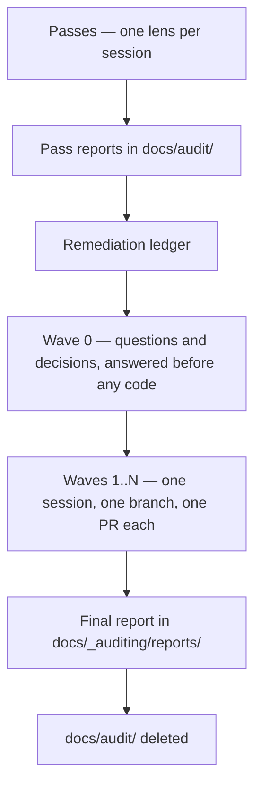

# `_auditing` — how this repo is audited

An **audit programme** is a fixed sequence: read-only passes produce reports, a ledger turns the
reports into a plan, remediation waves execute the plan one pull request at a time, and a final
report replaces the working documents. This folder holds the method. Everything a programme
produces while it runs lives in `docs/audit/`, which is gitignored and deleted at the end.

| File / folder                                          | What it holds                                                     |
| ------------------------------------------------------ | ----------------------------------------------------------------- |
| This README                                            | Programme lifecycle, artifacts, concurrency, session rules        |
| [`lessons.md`](lessons.md)                             | Traps and failure modes to check before running anything          |
| [`ledger-template.md`](ledger-template.md)             | Skeleton for the remediation ledger                               |
| [`final-report-template.md`](final-report-template.md) | Skeleton for the permanent report                                 |
| [`prompts/`](prompts/)                                 | One prompt per pass, plus the shared protocol and the wave prompt |
| [`reports/`](reports/)                                 | Final reports of completed programmes. Permanent.                 |

The `/audit:*` commands in `.claude/commands/audit/` load and apply these files. Behaviour lives
here; the commands are wrappers.

---

## 1. The lifecycle

| Phase      | Command           | Sessions      | Writes                                                  |
| ---------- | ----------------- | ------------- | ------------------------------------------------------- |
| 1 · Passes | `/audit:pass`     | One per pass  | One report per pass, in `docs/audit/`                   |
| 2 · Ledger | `/audit:plan`     | One           | `docs/audit/0-remediation-ledger.md`                    |
| 3 · Wave 0 | —                 | Owner answers | Answers recorded in the ledger                          |
| 4 · Waves  | `/audit:wave <n>` | One per wave  | Source code, on a branch, plus wave report              |
| 5 · Close  | `/audit:finish`   | One           | `reports/<yyyy-mm>-<surface>.md`; deletes `docs/audit/` |

`/audit:status` reconstructs programme state and resumes interrupted work. Run it first after any
crash, token exhaustion, or return from a break.

**Phase rules:**

1. **Passes are report-only.** Zero fixes, zero source changes. A pass writes one report and stops.
2. **The ledger is built once**, after the last pass, from the reports' summary and verdict sections
   only. It collects the questions that block work, maps the same defect appearing in several
   reports under different lenses (fix-once items), and assigns every finding to a wave.
3. **Wave 0 completes before any code changes.** Answers to blocking questions routinely invert
   findings — a fix written against an unanswered question can be the exact opposite of correct.
4. **A wave is one branch, one pull request, one fresh session.**
5. **Close** writes the final report, then deletes `docs/audit/`. The final report is the only
   artifact that survives, so it must be self-contained: no claim in it may depend on a deleted
   file (DS12).

Wave count is whatever the dependency structure needs. Split any wave whose pull request would be
too large to review.

---

## 2. Can phases run at the same time?

| Combination                                         | Allowed | Why                                                                                                                            |
| --------------------------------------------------- | :-----: | ------------------------------------------------------------------------------------------------------------------------------ |
| Passes on **different surfaces**, parallel sessions |   Yes   | Separate report files, separate contexts, no shared writable state                                                             |
| Passes on the **same surface**, parallel sessions   |   No    | Each pass reads the earlier reports of its surface and cites them instead of re-reporting; in parallel, none of them exist yet |
| A pass alongside a wave                             |   No    | The wave changes the code the pass is reporting on, so the report describes a tree that no longer exists                       |
| Two waves                                           |   No    | Waves share one mutable ledger and both branch from `main`; concurrent edits corrupt the plan and produce conflicting branches |
| Anything alongside `/audit:plan` or `/audit:finish` |   No    | Both read the complete set of working documents and assume it is not moving                                                    |

**Two constraints apply to parallel passes:**

- **Only one session may edit `docs/_auditing/lessons.md` at a time.** It is a tracked file and the
  lessons harvest at the end of a pass writes to it. Parallel passes hold their harvest until they
  hand off, then merge one at a time.
- **Cross-surface findings still need an ordering.** A pass told to read another surface's report
  reports what it can and files the rest as a question for the ledger; it never waits.

Running passes in parallel trades the cite-don't-re-report saving for wall-clock time. The cost lands
on the ledger, which then has to untangle duplicate findings by hand.

---

## 3. The artifacts and what survives

| Artifact                                          | Holds                                   | Rule                                                                            |
| ------------------------------------------------- | --------------------------------------- | ------------------------------------------------------------------------------- |
| Pass reports (`docs/audit/`)                      | Evidence — every finding with file:line | Written once, never edited afterwards; the ledger amends them                   |
| The ledger (`docs/audit/0-remediation-ledger.md`) | The plan and its status                 | **The only artifact that survives a context reset.** Rows are status, not story |
| Wave reports (`docs/audit/wave-reports.md`)       | Narrative — what was done and why       | One section per wave; revised in place, never appended to                       |
| Final report (`reports/`)                         | The permanent account                   | Written at close; self-contained                                                |

**The ledger row wins wherever it contradicts a report.** Wave 0 answers and later waves amend
findings; the reports are never rewritten to match. A session acting on a report section without
reading its ledger row will re-apply a fix that was already reversed.

**A closed row is a status marker, the constraints a later wave must obey, and a link to the wave
report** — 150 to 600 characters. Anything longer belongs in the wave report.

**`docs/audit/` is gitignored, and that is deliberate.** This repository is public; committing pass
reports or the ledger would publish unfixed findings, security findings included, while they are
still being remediated. Three consequences the protocol accounts for:

- The ledger lives on one machine's disk, not in git. Snapshot it to
  `docs/audit/.snapshots/<date>-<time>.md` before any bulk edit so a botched edit has a last-good
  version to diff against.
- Never bulk-edit the ledger with pattern-matched scripts. Use line-scoped edits.
- A reviewer on GitHub can see neither the ledger nor the wave report, so **every pull request body
  must stand alone.** It carries the summary itself, never a pointer to a local file.

CLAUDE.md §3 names `docs/audit/` as the one gitignored path this workflow may read and write.

---

## 4. Interruption and resume

Sessions die — context exhaustion, token budgets, crashes. Every phase is built so a fresh session
continues with minimal waste.

**A pass** writes its coverage ledger first and appends the report **check by check as each check
completes**, never holding the report in memory for one final write. A killed pass leaves its
finished checks on disk. On resume: read the existing report, continue from the first check with no
section or a section marked `INCOMPLETE`, and do not redo completed checks.

**A wave** commits code per row or small row-group and updates the ledger **at the same moment** —
`[~]` the moment work on a row starts, `[x]` when its commit lands. A killed wave leaves the branch
and the on-disk ledger agreeing about what is done. On resume: read the wave's rows, run `git log`
and `git diff main...`, reconcile (a `[~]` row means inspect the diff — the work may be partial),
and continue from the first unfinished row.

**Never batch a whole wave into one commit.** One large uncommitted diff is the most expensive state
to die in. `/audit:status` automates both reconciliations.

---

## 5. Session rules

- **One session per pass, one session per wave.** Never two passes, never two waves, never a pass
  and a wave together. `/clear` between sessions: carrying one pass's context into the next makes
  the model summarise instead of scan.
- **Context budget.** Never load a whole pass report and never load two. A wave session gets the
  ledger plus only the specific report sections its rows name. Those section lists are derived from
  the rows' `§` column — re-derive them whenever a row is added, merged or moved.
- **Findings are claims, not facts.** Every wave starts by re-verifying the findings it is about to
  act on against the current code. Reports go stale, miscount blast radius, and carry replacement
  snippets that were never executed. [`lessons.md`](lessons.md) §1 catalogues the shapes.
- **Ask more, not less.** A finding that is ambiguous, a change that is user-visible, a decision that
  reopens something ratified, two fixes that conflict — each is an owner question. Collect them
  during planning and put them as **one batch** with measured options and a recommendation. A
  question is cheaper than a reverted wave.
- **Independent review is a phase, not a favour.** After implementation and before the wave report,
  review the wave's own diff as if it were unreviewed code from a stranger. Re-checking the list
  that produced the diff is a different, weaker lens and misses what this catches.
- **Revise in place, never append a correction.** When later work changes what an already-written
  row or report section says, edit that text to state the final position and log the change under
  "Revisions after first publication". Appended corrections leave a document contradicting itself
  hundreds of lines apart.

---

## 6. Close-out, identical every wave

The owner does exactly two things: click **Create pull request** and **Merge**. Everything else is
the session's job, in this order, with no variation:

1. **Gate.** `./scripts/verify.sh` — the full form when the wave touches `src/core/config.ts`,
   `src/core/auth.ts`, `src/instrumentation.ts`, or rendering; `--quick` otherwise. Report the
   actual output and exit code, never the word "passing", and never a hand-typed substitute chain.
2. **Exit gate.** Confirm the wave's own clauses, manual ones included. A clause that needs a human
   or wall-clock time becomes its own row with a trigger — never tick it unverified, never stall the
   wave on it.
3. **Independent review** of the full diff (see §5).
4. **Wave report** in `wave-reports.md`, plus the lessons harvest, in the same commit. Then trim the
   ledger rows: rows are status, the report is the story.
5. **Consistency sweep** — rows against code, report against final state, numbers, row ownership,
   forward instructions.
6. **Push the branch.** Then print, in one copy-paste block, the pull request **title**
   (`Scope: what changed`, per [`docs/workflows/`](../workflows/README.md)) and **body**: what the
   branch achieves, what was verified and how, what was deliberately left undone, resolved
   divergences, and ADR links wherever a ratified decision was touched. `gh` is not installed —
   never attempt `gh pr create`.

---

## 7. Prompt hygiene

Prompts rot where they hardcode facts. Three rules:

- **Derive counts, inventories and versions at run time.** State the grep that produces a list, never
  the list. State "the file count you actually read", never a number. Any fact baked into a prompt
  drifts from the code and is then wrong in a way no gate detects.
- **Reference a checklist by its source** (CLAUDE.md §2, an ADR, a spec sheet) instead of copying it,
  so the prompt cannot disagree with the source.
- **Shared discipline lives once**, in [`prompts/_shared-protocol.md`](prompts/_shared-protocol.md).
  A pass prompt carries only its lens: scope, numbered checks, required tables, priority order,
  boundaries.

Prompts are also documentation, so DS14 applies: they name what exists now. A prompt must be fully
understandable to someone who has never seen a previous programme — no reference to a past audit,
a past session, or a finding identifier that no longer resolves to a tracked file.
