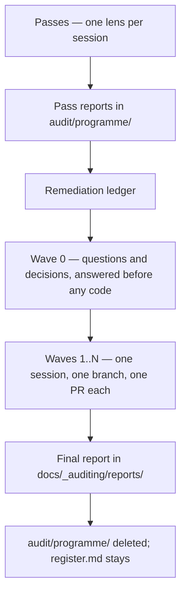

# `_auditing` — how this repo is audited

An **audit programme** is a fixed sequence: read-only passes produce reports, a ledger turns the
reports into a plan, remediation waves execute the plan one pull request at a time, and a final
report replaces the working documents. This folder holds the method.

Working documents live under `docs/audit/`, which is gitignored, in two tiers:

```
docs/audit/
├── register.md    the standing failure-mode register — survives every close, one per repository
└── programme/     the current programme — reports, ledger, wave reports; deleted at close
```

**`programme/` is what `/audit:finish` deletes**, which is why it is a folder rather than an
exception clause: an irreversible delete should have an unambiguous target. The register outlives it
because hazards are a property of the system, not of one programme, and re-deriving them per surface
would throw away the part that cost the most — the severities the owner confirmed.

| File / folder                                          | What it holds                                                     |
| ------------------------------------------------------ | ----------------------------------------------------------------- |
| This README                                            | Programme lifecycle, artifacts, session rules, close-out          |
| [`lessons.md`](lessons.md)                             | Traps and failure modes to check before running anything          |
| [`ledger-template.md`](ledger-template.md)             | Skeleton for the remediation ledger                               |
| [`final-report-template.md`](final-report-template.md) | Skeleton for the permanent report                                 |
| [`prompts/`](prompts/)                                 | One prompt per pass, plus the shared protocol and the wave prompt |
| [`reports/`](reports/)                                 | Final reports of completed programmes. Permanent.                 |

The `/audit:*` commands in `.claude/commands/audit/` load and apply these files. Behaviour lives
here; the commands are wrappers.

**One audit here is not a programme: `/docs:audit`.** See
[the documentation sweep](#5-the-documentation-sweep-not-a-programme) below.

---

## 1. The lifecycle



| Phase      | Command           | Sessions      | Writes                                                 |
| ---------- | ----------------- | ------------- | ------------------------------------------------------ |
| 1 · Passes | `/audit:pass`     | One per pass  | One report per pass, in `audit/programme/`             |
| 2 · Ledger | `/audit:plan`     | One           | `docs/audit/programme/0-remediation-ledger.md`         |
| 3 · Wave 0 | —                 | Owner answers | Answers recorded in the ledger                         |
| 4 · Waves  | `/audit:wave <n>` | One per wave  | Source code, on a branch, plus wave report             |
| 5 · Close  | `/audit:finish`   | One           | `reports/<yyyy-mm>-<surface>.md`; deletes `programme/` |

`/audit:status` reconstructs programme state and resumes interrupted work. Run it first after any
crash, token exhaustion, or return from a break.

**What the owner actually does.** Everything else is the session's job.

1. Run each command above in its own session, `/clear` between them.
2. Answer the Wave 0 question batch after `/audit:plan`. **Nothing proceeds until this is done** —
   the ledger carries a `Wave 0 status:` line and `/audit:wave` refuses to run while it says `OPEN`.
3. Answer each wave's single batched question set.
4. Per wave: click **Create pull request**, then **Merge**, then `git checkout main && git pull --ff-only`.
5. Confirm the deletion at `/audit:finish`.

**Each command checks its own preconditions and stops rather than guessing** — a missing ledger, an
unanswered Wave 0, an earlier wave still open, a dirty tree, a report the code has drifted far past.
The checks are listed in each command file.

**One programme audits one surface.** Its working documents all live in `audit/programme/`, so a second
programme cannot run beside it. The `crosscut` pass is the exception that needs no second programme:
it derives both halves of every seam from the code, so it works whichever surface is being audited.

### 1.1 Passes

One lens per session, each writing one report. **Report-only: zero fixes, zero source changes.**

**The order is risk → surface → crosscut, and it is not arbitrary:**

1. **`risk` first.** It enumerates what would actually hurt, traces each outcome to the paths that
   could produce it, and assigns every one to the pass that should look there. Without it every lens
   is shaped like the stack, and a hazard nobody's lens covers is invisible rather than reported. Its
   register also sets the severity every later pass inherits, so severity means the same thing across
   the whole programme.
2. **Surface passes**, in their numbered order, because each cites the earlier reports of its own
   surface instead of re-reporting their findings. Each reads the register rows assigned to it and
   states in its verdict whether it covered them.
3. **`crosscut` last.** The seams between surfaces belong to none of them. It derives both halves of
   every seam from the code, so it runs in any programme.

Every pass ends by naming the **controls that would prevent recurrence** for the classes it found.
Those become the ledger's guardrail backlog.

**The risk pass writes the standing register, so it is not repeated per surface.** It runs in one of
two modes, and it decides which by looking:

| Mode        | When                               | What it does                                                                                                                                                 |
| ----------- | ---------------------------------- | ------------------------------------------------------------------------------------------------------------------------------------------------------------ |
| **Create**  | `audit/register.md` does not exist | Builds it from scratch. The severities go to the owner for confirmation.                                                                                     |
| **Refresh** | It exists                          | Re-verifies existing rows against current code, adds hazards the code has grown, re-maps coverage to this programme's passes. Confirmed severities are kept. |

A refresh is much cheaper than a create, which is the point: **the expensive part of the register is
the owner's judgment about what matters, and that is not re-derived.** So auditing the frontend and
then the backend means one create and one refresh, not two creates.

The refresh is also where staleness is caught. The register records the commit it was last verified
at; if the code has moved a long way since, the refresh says so before trusting a single row.

### 1.2 Ledger

Built **once**, after the last pass, from each report's **summary table and verdict only** — never a
whole report. Those two sections are a contract: the shared protocol requires every finding,
question, needs-human item and decision-to-confirm to be reachable from them, so nothing the ledger
needs is stranded in a report body.

The ledger collects the questions that block work, maps one defect appearing in several reports
under different lenses into fix-once items, and assigns every finding to a wave. It also carries two
things that are not findings: the **guardrail backlog**, merged from every pass's
controls-that-prevent-recurrence list, and the **failure-mode register carry-over**, which records
what the programme did about every hazard the risk pass registered — a ledger row, an accepted risk,
or a roadmap item, never nothing.

**Schedule guardrails early.** A control landing in Wave 1 catches mistakes made in every wave after
it; the same control landing last catches nothing.

### 1.3 Wave 0

Every blocking question answered and every owner decision settled **before any code changes**.
Answers routinely invert findings — a fix written against an unanswered question can be the exact
opposite of correct.

### 1.4 Waves

**One wave = one branch = one pull request = one fresh session.** Wave count is whatever the
dependency structure needs; split any wave whose pull request would be too large to review. Each
wave verifies its findings, batches its owner questions, implements, and runs the close-out in §4.

### 1.5 Close

The final report is written to `reports/`, then `docs/audit/programme/` is deleted. **`register.md`
stays.** The report is the only artifact of the programme that survives, so it must be
**self-contained**: no claim in it may depend on a deleted file (DS12).

It also compares itself against the previous programme on the same surface — findings by severity,
the false-positive rate, findings in classes an earlier guardrail should have prevented, and hazards
left uncovered. **A programme should find less than the last one**, and this is the only place that
question is asked.

---

## 2. The artifacts

| Artifact                                   | Holds                                   | Lifetime                       |
| ------------------------------------------ | --------------------------------------- | ------------------------------ |
| `audit/register.md`                        | Failure modes, their controls, severity | **Standing** — survives closes |
| `audit/programme/<prefix><n>-*.md`         | Evidence — every finding with file:line | Deleted at close               |
| `audit/programme/0-remediation-ledger.md`  | The plan and its status                 | Deleted at close               |
| `audit/programme/wave-reports.md`          | Narrative — what was done and why       | Deleted at close               |
| `_auditing/reports/<yyyy-mm>-<surface>.md` | The permanent account                   | Permanent, tracked, public     |

### Why `audit/` is gitignored

This repository is public. Committing pass reports, the ledger or the register would publish unfixed
findings — security findings included — while they are still being remediated. CLAUDE.md's security section names
`docs/audit/` as the one ignored path this workflow may read and write.

Three consequences the protocol works around:

- **The ledger lives on one machine's disk, not in git.** Snapshot it to
  `audit/programme/.snapshots/<date>-<time>.md` before any bulk edit, so a botched edit has a
  last-good version to diff against.
- **Never bulk-edit the ledger with pattern-matched scripts.** Line-scoped edits only.
- **Every pull request body stands alone.** A reviewer on GitHub can see none of these files, so the
  body carries its summary itself and never points at one.

### Rules per artifact

- **A pass report is written once and never edited afterwards.** The ledger amends findings; reports
  are not rewritten to match. Each report records the **commit it was audited at**, so any later
  phase can measure how far the code has moved since.
- **The ledger row wins wherever it contradicts a report.** A session acting on a report section
  without reading its ledger row will re-apply a fix that was already reversed.
- **The ledger is the only artifact that survives a context reset.** It must be complete enough for a
  fresh session to continue from it plus git alone.
- **A ledger row is status, not story** — a status marker, the constraints a later wave must obey,
  and a link to the wave report, in 150 to 600 characters. Anything longer belongs in the wave
  report.
- **A wave report is revised in place, never appended to.** Corrections appended below text that
  still says the old thing leave a document contradicting itself.
- **The register is amended, never rebuilt.** A hazard whose severity the owner confirmed keeps that
  severity until the owner changes it.

---

## 3. Session rules

- **One session per pass, one session per wave.** Never two passes, never two waves, never a pass
  and a wave together. `/clear` between sessions: carrying one pass's context into the next makes
  the model summarise instead of scan.
- **Context budget.** Never load a whole pass report and never load two. A wave session gets the
  ledger plus only the specific report sections its rows name. Those section lists are derived from
  the rows' `§` column — re-derive them whenever a row is added, merged or moved.
- **Findings are claims, not facts.** Every wave starts by re-verifying the findings it is about to
  act on against the current code. Reports go stale, miscount blast radius, and carry replacement
  snippets that were never executed. [`lessons.md` §1](lessons.md) catalogues the shapes.
- **Ask more, not less.** A finding that is ambiguous, a change that is user-visible, a decision that
  reopens something ratified, two fixes that conflict — each is an owner question. Collect them
  during planning and put them as **one batch** with measured options and a recommendation. A
  question is cheaper than a reverted wave.
- **Independent review is a phase, not a favour.** After implementation and before the wave report,
  review the wave's own diff as if it were unreviewed code from a stranger. Re-checking the list
  that produced the diff is a different, weaker lens and misses what this catches.
- **Revise in place, never append a correction.** When later work changes what an already-written
  row or report section says, edit that text to state the final position and log the change under
  "Revisions after first publication".

### Recording work as it happens

**This is how every pass and every wave runs, not a recovery procedure.** Work is written to disk as
it completes, so that at every moment the files on disk state what is done. That a dead session can
then be resumed cheaply is the consequence, not the purpose.

**In a pass:** write the coverage ledger skeleton before starting check 1, then append the report
**check by check as each check completes**, filling that check's ledger row at the same moment.
Never hold the report in memory for one final write.

**In a wave:** commit code per row or small row-group, and update the ledger **at the same moment** —
`[~]` when work on a row starts, `[x]` when its commit lands. **Never batch a whole wave into one
commit.** A large uncommitted diff is unreviewable while it exists and unrecoverable if it is lost,
and it hides which rows are actually finished from everyone including the session writing it.

**Because of that discipline, resuming is mechanical.** A killed pass leaves its finished checks on
disk: continue from the first check with no section or one marked `INCOMPLETE`, and do not redo
completed checks. A killed wave leaves the branch and the on-disk ledger agreeing: read the wave's
rows, run `git log` and `git diff main...`, reconcile — a `[~]` row means inspect the diff, the work
may be partial — and continue from the first unfinished row. `/audit:status` automates both
reconciliations.

---

## 4. Close-out, identical every wave

The owner does exactly two things: click **Create pull request** and **Merge**. Everything else is
the session's job, in this order, with no variation and no steps skipped.

### 4.1 Run the full gate

```bash
./scripts/verify.sh
```

**The full gate runs on every wave.** The single exception is a wave that changed **documentation
only**, which may use `./scripts/verify.sh --quick`. Any wave touching source, config, scripts,
Docker or CI runs the full form, whatever the change looks like — the classes that pass a partial
gate and break the built image are exactly the ones that look harmless in a diff.

This is deliberately stricter than the repository-wide minimum in CLAUDE.md. An audit wave ships
changes that were reasoned about rather than requested, so it carries the higher bar.

Report the script's **actual output and exit code**. Never the word "passing", never a hand-typed
substitute chain.

### 4.2 Handle what the gate rewrote

The gate mutates the tree — the formatter runs in write mode first. Commit what it reformats, and
**read the post-gate diff**: the formatter has corrupted conditional class strings before, and
nothing else in the gate sees that.

### 4.3 Confirm the exit gate and the guardrails

Every exit-gate clause, manual ones included. A clause that needs a human or wall-clock time becomes
its own ledger row with a trigger — never tick it unverified, and never stall the wave on it.

Then the guardrails. For every defect class this wave fixed, either its control from the ledger's
guardrail backlog is in place and was **demonstrated failing against the old code**, or a row records
why no control is possible. A control never shown to fail on its target is an untested assertion — a
rule can pass every one of its tests with its load-bearing part deleted.

**A control lands at warning level and is flipped to `error` by the wave that clears the last
violation.** Setting it to `error` while known violations remain fails the gate and blocks the wave.

### 4.4 Independent review

Review the wave's full diff as unreviewed code from a stranger, against CLAUDE.md and the ADRs.
Verify every ticked row against the diff at **all** its call sites, not the one the report named.
Fix what it finds before proceeding.

### 4.5 Write the wave report and harvest lessons

Both in the same commit. The wave report goes in `wave-reports.md` and is written for a reader who
was not in the session. The lessons harvest merges any durable, **verified** trap into the matching
section of [`lessons.md`](lessons.md). Then trim the ledger rows: rows are status, the report is the
story.

### 4.6 Run the consistency sweep

Rows against code · report against final state · numbers · row ownership · forward instructions.
Where anything changed after a row or section was written, revise it in place.

### 4.7 Push and hand over

Push the branch, then print in one copy-paste block the pull request **title**
(`Scope: what changed`, per [`docs/workflows/`](../workflows/README.md)) and **body**: what the
branch achieves, what was verified and how, what was deliberately left undone, resolved divergences,
and ADR links wherever a ratified decision was touched. Open it with `gh pr create --draft` and hand
over the link. **Never `gh pr ready` and never `gh pr merge`** — marking a draft ready is the act of
saying it passed review, and that is the owner's.

---

## 5. The documentation sweep, not a programme

**`/docs:audit` audits what is written down rather than what runs**, so almost nothing above applies
to it: no register, no ledger, no waves, no final report, and no `programme/` folder to delete. It is
listed here because this is where audits are described, and separated here because treating it as a
programme would put a second one beside the running one — which §1 forbids for good reasons that do
not apply to reading prose.

| It shares                                                                | It does not have                                    |
| ------------------------------------------------------------------------ | --------------------------------------------------- |
| Report-only: the audit session fixes nothing                             | A risk pass, a register, severities the owner sets  |
| Findings are claims, re-verified before anything acts on them            | A ledger and waves — fixes go in one pull request   |
| Working documents under `docs/audit/`, gitignored on a public repository | A permanent report; a sweep's value expires quickly |

**The corpus is every document and every comment**: `/docs`, the repository-root documents, CLAUDE.md,
the command files, and the module headers, docstrings and comments in the source, which the standard
covers exactly as it covers a spec sheet (DS20). It is partitioned into segments, and each segment
goes to an agent that reads it **in full** and has seen none of the rest — independence is the
mechanism, because the session that wrote a page cannot feel what is missing from it.

It runs against `docs/_standard/`, and finds the classes the four defences in
[`../_standard/5-currency.md`](../_standard/5-currency.md) structurally cannot: a page no change has
touched, a sentence a stranger could not act on, a fact stated in two places, a citation that
resolves but is not evidence for the claim beside it.

**`/docs:audit` reports and `/docs:audit fix` repairs, never in one session.** An audit that fixes as
it goes stops looking at the point it starts repairing, and then grades its own work. The report goes
to `docs/audit/documentation-<yyyy-mm-dd>.md` — beside `programme/`, never inside it, because
`/audit:finish` deletes that folder and a sweep is not part of any programme's lifecycle. Behaviour
is in `.claude/commands/docs/audit.md`.

## 6. Prompt hygiene

Prompts rot where they hardcode facts. Four rules:

- **Derive counts, inventories and versions at run time.** State the grep that produces a list, never
  the list. State "the file count you actually read", never a number. Any fact baked into a prompt
  drifts from the code and is then wrong in a way no gate detects.
- **Reference a checklist by its source** (CLAUDE.md, an ADR, a spec sheet) instead of copying it,
  so the prompt cannot disagree with the source.
- **Shared discipline lives once**, in [`prompts/_shared-protocol.md`](prompts/_shared-protocol.md).
  A pass prompt carries only its lens: scope, numbered checks, required tables, priority order,
  boundaries.
- **Prompts are documentation, so DS14 applies**: they name what exists now. A prompt must be fully
  understandable to someone who has never run a programme here — no reference to a past audit, a
  past session, or an identifier that no longer resolves to a tracked file.
