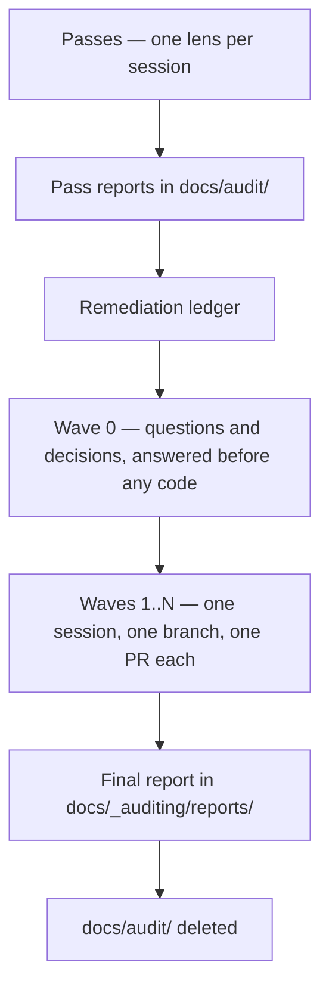

# `_auditing` — how this repo is audited

An **audit programme** is a fixed sequence: read-only passes produce reports, a ledger turns the
reports into a plan, remediation waves execute the plan one pull request at a time, and a final
report replaces the working documents. This folder holds the method. Everything a programme
produces while it runs lives in `docs/audit/`, which is gitignored and deleted at the end.

| File / folder                                          | What it holds                                                     |
| ------------------------------------------------------ | ----------------------------------------------------------------- |
| This README                                            | Programme lifecycle, artifacts, session rules, close-out          |
| [`lessons.md`](lessons.md)                             | Traps and failure modes to check before running anything          |
| [`ledger-template.md`](ledger-template.md)             | Skeleton for the remediation ledger                               |
| [`final-report-template.md`](final-report-template.md) | Skeleton for the permanent report                                 |
| [`prompts/`](prompts/)                                 | One prompt per pass, plus the shared protocol and the wave prompt |
| [`reports/`](reports/)                                 | Final reports of completed programmes. Permanent.                 |

The `/audit:*` commands in `.claude/commands/audit/` load and apply these files. Behaviour lives
here; the commands are wrappers.

---

## 1. The lifecycle



| Phase      | Command           | Sessions      | Writes                                                  |
| ---------- | ----------------- | ------------- | ------------------------------------------------------- |
| 1 · Passes | `/audit:pass`     | One per pass  | One report per pass, in `docs/audit/`                   |
| 2 · Ledger | `/audit:plan`     | One           | `docs/audit/0-remediation-ledger.md`                    |
| 3 · Wave 0 | —                 | Owner answers | Answers recorded in the ledger                          |
| 4 · Waves  | `/audit:wave <n>` | One per wave  | Source code, on a branch, plus wave report              |
| 5 · Close  | `/audit:finish`   | One           | `reports/<yyyy-mm>-<surface>.md`; deletes `docs/audit/` |

`/audit:status` reconstructs programme state and resumes interrupted work. Run it first after any
crash, token exhaustion, or return from a break.

**Phase rules:**

1. **Passes are report-only.** Zero fixes, zero source changes. A pass writes one report and stops.
2. **Passes run in numbered order within a surface**, because each cites the earlier reports of its
   surface instead of re-reporting their findings. A `crosscut` pass, which audits the seams between
   surfaces, runs after every surface pass in the programme.
3. **The ledger is built once**, after the last pass, from each report's **summary table and
   verdict** only — never a whole report. Those two sections are therefore a contract: the shared
   protocol requires every finding, question, needs-human item and decision-to-confirm to be
   reachable from them, so nothing the ledger needs is stranded in the body.
4. **Wave 0 completes before any code changes.** Answers to blocking questions routinely invert
   findings — a fix written against an unanswered question can be the exact opposite of correct.
5. **A wave is one branch, one pull request, one fresh session.**
6. **Close** writes the final report, then deletes `docs/audit/`. The final report is the only
   artifact that survives, so it must be self-contained: no claim in it may depend on a deleted
   file (DS12).

Wave count is whatever the dependency structure needs. Split any wave whose pull request would be
too large to review.

---

## 2. The artifacts and what survives

| Artifact                                          | Holds                                   | Lifetime                      |
| ------------------------------------------------- | --------------------------------------- | ----------------------------- |
| Pass reports (`docs/audit/`)                      | Evidence — every finding with file:line | Deleted at close              |
| The ledger (`docs/audit/0-remediation-ledger.md`) | The plan and its status                 | Deleted at close              |
| Wave reports (`docs/audit/wave-reports.md`)       | Narrative — what was done and why       | Deleted at close              |
| Final report (`reports/`)                         | The permanent account                   | Permanent, and self-contained |

**Rules:**

- **A pass report is written once and never edited afterwards.** The ledger amends findings; the
  reports are not rewritten to match.
- **The ledger row wins wherever it contradicts a report.** A session acting on a report section
  without reading its ledger row will re-apply a fix that was already reversed.
- **The ledger is the only artifact that survives a context reset.** It must be complete enough for
  a fresh session to continue from it plus git alone.
- **A ledger row is status, not story** — a status marker, the constraints a later wave must obey,
  and a link to the wave report, in 150 to 600 characters. Anything longer belongs in the wave
  report.
- **A wave report is revised in place, never appended to.** Corrections appended below text that
  still says the old thing leave a document contradicting itself.
- **`docs/audit/` is gitignored**, because this repository is public and committing pass reports or
  the ledger would publish unfixed findings — security findings included — while they are still
  being remediated. CLAUDE.md §3 names it as the one ignored path this workflow may read and write.
- **Snapshot the ledger to `docs/audit/.snapshots/<date>-<time>.md` before any bulk edit**, so a
  botched edit has a last-good version to diff against.
- **Never bulk-edit the ledger with pattern-matched scripts.** Line-scoped edits only.
- **Every pull request body stands alone.** A reviewer on GitHub can see neither the ledger nor the
  wave report, so the body carries its summary itself and never points at a local file.

---

## 3. Session rules

- **One session per pass, one session per wave.** Never two passes, never two waves, never a pass
  and a wave together. `/clear` between sessions: carrying one pass's context into the next makes
  the model summarise instead of scan.
- **Context budget.** Never load a whole pass report and never load two. A wave session gets the
  ledger plus only the specific report sections its rows name. Those section lists are derived from
  the rows' `§` column — re-derive them whenever a row is added, merged or moved.
- **Findings are claims, not facts.** Every wave starts by re-verifying the findings it is about to
  act on against the current code. Reports go stale, miscount blast radius, and carry replacement
  snippets that were never executed. [`lessons.md` §1](lessons.md) catalogues the shapes.
- **Ask more, not less.** A finding that is ambiguous, a change that is user-visible, a decision that
  reopens something ratified, two fixes that conflict — each is an owner question. Collect them
  during planning and put them as **one batch** with measured options and a recommendation. A
  question is cheaper than a reverted wave.
- **Independent review is a phase, not a favour.** After implementation and before the wave report,
  review the wave's own diff as if it were unreviewed code from a stranger. Re-checking the list
  that produced the diff is a different, weaker lens and misses what this catches.
- **Revise in place, never append a correction.** When later work changes what an already-written
  row or report section says, edit that text to state the final position and log the change under
  "Revisions after first publication".

### When a session dies

Sessions die — context exhaustion, token budgets, crashes. Every phase is built so a fresh session
continues with minimal waste. `/audit:status` automates both reconciliations below.

**A pass** writes its coverage ledger first and appends the report **check by check as each check
completes**, never holding the report in memory for one final write. A killed pass leaves its
finished checks on disk. On resume: read the existing report, continue from the first check with no
section or a section marked `INCOMPLETE`, and do not redo completed checks.

**A wave** commits code per row or small row-group and updates the ledger **at the same moment** —
`[~]` the moment work on a row starts, `[x]` when its commit lands. A killed wave leaves the branch
and the on-disk ledger agreeing about what is done. On resume: read the wave's rows, run `git log`
and `git diff main...`, reconcile (a `[~]` row means inspect the diff — the work may be partial),
and continue from the first unfinished row.

**Never batch a whole wave into one commit.** One large uncommitted diff is the most expensive state
to die in.

---

## 4. Close-out, identical every wave

The owner does exactly two things: click **Create pull request** and **Merge**. Everything else is
the session's job, in this order, with no variation and no steps skipped.

### 4.1 Run the full gate

```bash
./scripts/verify.sh
```

**The full gate runs on every wave.** The single exception is a wave that changed **documentation
only**, which may use `./scripts/verify.sh --quick`. Any wave touching source, config, scripts,
Docker or CI runs the full form, whatever the change looks like — the classes that pass a partial
gate and break the built image are exactly the ones that look harmless in a diff.

This is deliberately stricter than the repository-wide minimum in CLAUDE.md §4. An audit wave ships
changes that were reasoned about rather than requested, so it carries the higher bar.

Report the script's **actual output and exit code**. Never the word "passing", never a hand-typed
substitute chain.

### 4.2 Handle what the gate rewrote

The gate mutates the tree — the formatter runs in write mode first. Commit what it reformats, and
**read the post-gate diff**: the formatter has corrupted conditional class strings before, and
nothing else in the gate sees that.

### 4.3 Confirm the wave's own exit gate

Every clause, manual ones included. A clause that needs a human or wall-clock time becomes its own
ledger row with a trigger — never tick it unverified, and never stall the wave on it.

### 4.4 Independent review

Review the wave's full diff as unreviewed code from a stranger, against CLAUDE.md and the ADRs.
Verify every ticked row against the diff at **all** its call sites, not the one the report named.
Fix what it finds before proceeding.

### 4.5 Write the wave report and harvest lessons

Both in the same commit. The wave report goes in `wave-reports.md` and is written for a reader who
was not in the session. The lessons harvest merges any durable, **verified** trap into the matching
section of [`lessons.md`](lessons.md). Then trim the ledger rows: rows are status, the report is the
story.

### 4.6 Run the consistency sweep

Rows against code · report against final state · numbers · row ownership · forward instructions.
Where anything changed after a row or section was written, revise it in place.

### 4.7 Push and hand over

Push the branch, then print in one copy-paste block the pull request **title**
(`Scope: what changed`, per [`docs/workflows/`](../workflows/README.md)) and **body**: what the
branch achieves, what was verified and how, what was deliberately left undone, resolved divergences,
and ADR links wherever a ratified decision was touched. `gh` is not installed — never attempt
`gh pr create`.

---

## 5. Prompt hygiene

Prompts rot where they hardcode facts. Four rules:

- **Derive counts, inventories and versions at run time.** State the grep that produces a list, never
  the list. State "the file count you actually read", never a number. Any fact baked into a prompt
  drifts from the code and is then wrong in a way no gate detects.
- **Reference a checklist by its source** (CLAUDE.md §2, an ADR, a spec sheet) instead of copying it,
  so the prompt cannot disagree with the source.
- **Shared discipline lives once**, in [`prompts/_shared-protocol.md`](prompts/_shared-protocol.md).
  A pass prompt carries only its lens: scope, numbered checks, required tables, priority order,
  boundaries.
- **Prompts are documentation, so DS14 applies**: they name what exists now. A prompt must be fully
  understandable to someone who has never run a programme here — no reference to a past audit, a
  past session, or an identifier that no longer resolves to a tracked file.
