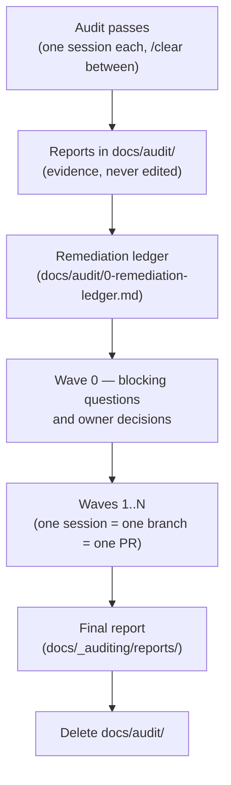

# `_auditing` — how this repo is audited

Everything about **how an audit-and-remediation programme is run** lives in this folder. Underscore-prefixed
because it is cross-cutting meta, like `_standard/` — it is about the process, not about any one surface.

**Extracted 2026-08-01** from the frontend programme (five passes, 188 findings, nine remediation waves,
2026-07-28 → 2026-08-01) before its working documents in `docs/audit/` were deleted. The method survived;
the working documents did not need to.

| File                                                   | What it covers                                                                         |
| ------------------------------------------------------ | -------------------------------------------------------------------------------------- |
| This README                                            | The programme lifecycle, the state model, and the session protocol                     |
| [`lessons.md`](lessons.md)                             | Every misstep and discovery from the frontend programme — read before running anything |
| [`ledger-template.md`](ledger-template.md)             | Copy-paste skeleton for the remediation ledger                                         |
| [`final-report-template.md`](final-report-template.md) | Skeleton for the one artifact that outlives the programme                              |
| [`prompts/`](prompts/)                                 | The pass prompts — six frontend, four backend, two ops, plus the wave prompt           |
| [`reports/`](reports/)                                 | Final reports of completed programmes. Permanent.                                      |

The `/audit:*` commands in `.claude/commands/audit/` are thin wrappers over this folder — behaviour
lives here, the commands only load and apply it.

---

## The lifecycle

A programme has five phases. Each phase's full instructions live in the prompt files; this section is
the map, not the manual.

1. **Passes.** One lens per session, each writing one report into `docs/audit/`. `/clear` between
   passes is mandatory — stale context from pass 1 poisons pass 3; the model starts summarising
   instead of scanning. Verify the report file exists on disk before clearing.
2. **Ledger.** Build `docs/audit/0-remediation-ledger.md` from [`ledger-template.md`](ledger-template.md):
   collect blocking questions, map cross-report overlap (the same defect surfaces in two or three
   passes under different lenses — those are fix-once items), and assign every finding to a wave.
   Wave count is whatever the dependency structure needs, not a fixed number — the frontend programme
   used nine and could have used more.
3. **Wave 0.** Answer every blocking question and settle every owner decision **before** any code
   changes. In the frontend programme, two HIGH findings inverted on Wave 0's answers — remediating
   them as written would have meant reverting.
4. **Waves.** One wave = one branch = one PR = one fresh session, run from
   [`prompts/remediation-wave.md`](prompts/remediation-wave.md). Each wave: verify the findings it
   touches → front-load owner questions as one batch → implement → gate → independent review →
   wave report → consistency sweep → close-out (push + PR text).
5. **Close.** Write the final report into `reports/` from
   [`final-report-template.md`](final-report-template.md), then delete `docs/audit/`. The final
   report is the only artifact that remains; DS12 already forbids citing `docs/audit/` as substance,
   so nothing else may depend on it.

---

## The state model — what survives a dead session

Three artifacts carry the programme's state, with a strict division of labour:

| Artifact                         | Holds                                          | Rule                                                                   |
| -------------------------------- | ---------------------------------------------- | ---------------------------------------------------------------------- |
| Pass reports (`docs/audit/`)     | Evidence — findings with file:line             | Written once per pass, never edited afterwards; the ledger amends them |
| The ledger                       | Plan and status — what must be done, done-ness | **The only artifact that survives a context reset.** Rows are status   |
| Wave reports (`wave-reports.md`) | Narrative — what was done, why, what it cost   | One section per wave; revised in place, never appended-to              |

**`docs/audit/` is gitignored — the working documents are local-only, by design.** The repo is
public, and committing pass reports or the ledger would publish unfixed findings (including
security findings) while they are being remediated. Consequences the protocol accounts for: the
ledger survives on the working machine's disk, not in git; before any bulk ledger edit, snapshot it
(`copy 0-remediation-ledger.md .snapshots/<date>-<time>.md` inside `docs/audit/`) so there is a
last-good version to diff against; and because a reviewer on GitHub can never see the wave report,
**every wave's PR body must stand alone** — it carries the human-readable summary, not a pointer.
CLAUDE.md §3 names `docs/audit/` as the one gitignored path the assistant may read and write.

**The ledger row wins wherever it contradicts a report.** Wave 0 answers and later waves amend
findings; the reports are never updated to match. A session acting on a report section without
reading its ledger row will re-apply a fix that was inverted.

**Closed rows are status, not story**: a status marker, the forward constraints a later wave must
obey, and a link to the wave report. 150–600 characters. Anything longer belongs in the wave report.

### Interruption and resume

Sessions die — context exhaustion, token budgets, crashes. The programme is built so that a fresh
session can continue with minimal waste, and every prompt carries the matching protocol:

**During a pass:** the coverage ledger is written first, and the report is **appended check-by-check
as each check completes** — never held in memory and written at the end. A killed pass leaves its
finished checks on disk. On resume: read the existing report, find the first check with no section
(or one marked `INCOMPLETE`), continue from there. Do not redo completed checks.

**During a wave:** commit code per row or per small row-group, and update the (untracked) ledger
**at the same moment** — tick the row when its commit lands, mark it `[~]` the moment work starts.
A killed wave leaves the branch and the on-disk ledger agreeing about exactly what is done. On
resume: read the ledger's wave table, `git log`/`git diff main...` the branch, reconcile (a `[~]`
row means "inspect the diff — the work may be partial"), continue from the first unticked row.
`/audit:status` automates this reconciliation for both cases.

**Never batch a whole wave into one commit.** One giant uncommitted diff is the maximally expensive
state to die in.

---

## Session protocol

- **One session per pass, one session per wave.** Never two passes or two waves in one session, and
  never a pass and a wave in the same session.
- **Context budget.** Never load a whole pass report and never load two. The frontend reports totalled
  ~1 MB. A wave session gets: the ledger, plus only the specific `§` sections its rows name. The
  ledger's per-wave section lists are derived from the rows' `§` column — re-derive them whenever a
  row is added, merged or moved (8 of 9 frontend lists were incomplete until audited).
- **Findings are claims, not facts.** Roughly a fifth of the frontend findings were wrong in some way
  — false positives, unsafe replacement snippets, stale counts. Every wave starts by re-verifying the
  findings it is about to act on, at the current code, before writing any fix. See
  [`lessons.md`](lessons.md) for the catalogue.
- **Ask more, not less.** Where a finding is ambiguous, a change is user-visible, a decision reopens
  something ratified, or two fixes conflict — that is an owner question. Collect them during planning
  and put them to the owner as **one batch** with measured options and a recommendation. Every
  frontend wave that skipped this stalled across multiple sittings; every review round found things
  "by a question, not by the gate".
- **Independent review is a phase, not a favour.** After implementation and before the wave report,
  review the wave's own diff as if it were unreviewed code from a stranger — a different lens than
  re-checking the list that produced it. This pass found real, shipped defects in **every** frontend
  wave it ran on, including regressions introduced by the wave's own first review pass.
- **Revise in place, never append a correction** (ledger Part 4c). When later work changes what an
  already-written row or report section says, edit that text to state the final position and log the
  change under "Revisions after first publication". Appending corrections is how a document ends up
  contradicting itself hundreds of lines apart.

## The close-out cycle (identical every wave)

The owner does exactly two things: click **Create pull request** and **Merge**. Everything else is the
session's job, in this order, no variation:

1. `./scripts/verify.sh` (full form when the wave touches `src/core/config.ts`, `src/core/auth.ts`,
   `src/instrumentation.ts`, or rendering; `--quick` otherwise) — report the actual exit code, never
   "passing".
2. Confirm the wave's own exit gate, including manual clauses. A clause needing a human or wall-clock
   time becomes its own row with a trigger — do not stall the wave and do not tick it unverified.
3. Write the wave report (template in `wave-reports.md`), trim the ledger rows, run the Part 4c sweep.
4. Commit everything; push the branch.
5. Print, in one block the owner can copy: the **PR title** (`Scope: what changed`, per
   `docs/workflows.md`) and the **PR body** (what the branch achieves, what was verified and how,
   what was deliberately left undone, resolved divergences, ADR links where a ratified decision was
   touched). `gh` is not installed — never attempt `gh pr create`; the block is the deliverable.

## Prompt hygiene

Prompts rot where they hardcode facts. The rules, learned the expensive way:

- **Derive counts and versions at runtime** ("state the file count you actually read"), never bake
  them in. The originals hardcoded ~169 files, line numbers and a wrong claim about a CSS utility's
  provenance, all of which drifted.
- **Reference checklists by their source** (CLAUDE.md §2, the spec sheets) instead of copying them,
  so the prompt cannot disagree with the source.
- **Shared discipline lives once**, in [`prompts/_shared-protocol.md`](prompts/_shared-protocol.md) —
  coverage ledger, traversal, budget honesty, nuance rule, resume protocol, ask-more-questions.
  Every new prompt starts by loading it; only the lens-specific checks live in the prompt itself.
