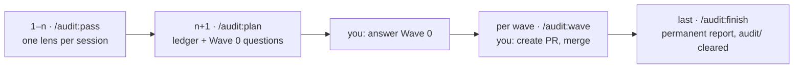

# Audit prompts

One file per pass, all in the same shape: the prompt carries only its **lens** — scope, numbered
checks, required tables, priority order, boundaries — and loads every shared rule from
[`_shared-protocol.md`](_shared-protocol.md) (report structure, coverage ledger, incremental
writing, resume protocol, ask-don't-guess, budget honesty, secrets). That split is deliberate:
shared discipline exists once and cannot drift per-prompt, and prompts stay fact-light — they state
how to _derive_ an inventory (a grep, a config read), never the inventory itself, because every
hardcoded fact in the first-generation prompts drifted.

The frontend prompts are the optimized successors of the five that ran the 2026-07 programme; the
originals' checklists survive here, their missteps in [`../lessons.md`](../lessons.md), and their
outcome in [`../reports/2026-07-frontend.md`](../reports/2026-07-frontend.md). The oversized
UI-quality lens is now two passes, which is why the frontend has six.

| Pass       | Lens                                        | Prompt                                                         |
| ---------- | ------------------------------------------- | -------------------------------------------------------------- |
| Frontend 1 | Deprecated and legacy patterns              | [`frontend-1-deprecated.md`](frontend-1-deprecated.md)         |
| Frontend 2 | Architecture, dead code, tooling            | [`frontend-2-architecture.md`](frontend-2-architecture.md)     |
| Frontend 3 | RSC/caching semantics, validation integrity | [`frontend-3-rsc-data.md`](frontend-3-rsc-data.md)             |
| Frontend 4 | Security and authorization                  | [`frontend-4-security.md`](frontend-4-security.md)             |
| Frontend 5 | Accessibility and UX states                 | [`frontend-5-a11y-ux.md`](frontend-5-a11y-ux.md)               |
| Frontend 6 | Styling system and performance              | [`frontend-6-styling-perf.md`](frontend-6-styling-perf.md)     |
| Backend 1  | Data consistency & write-path integrity     | [`backend-1-consistency.md`](backend-1-consistency.md)         |
| Backend 2  | Schema & contract boundary                  | [`backend-2-schema-boundary.md`](backend-2-schema-boundary.md) |
| Backend 3  | Security & authorization                    | [`backend-3-security.md`](backend-3-security.md)               |
| Backend 4  | Architecture, dead code, tests, tooling     | [`backend-4-architecture.md`](backend-4-architecture.md)       |
| Ops 1      | Build & deploy correctness                  | [`ops-1-build-deploy.md`](ops-1-build-deploy.md)               |
| Ops 2      | Security & topology                         | [`ops-2-security-topology.md`](ops-2-security-topology.md)     |

[`remediation-wave.md`](remediation-wave.md) is the session prompt for every remediation wave.

## Running a programme, step by step

Every numbered step below is its own fresh session. `/clear` between sessions is mandatory — stale
context from one pass makes the next one summarise instead of scan.

1. **Run the passes** — `/audit:pass backend 1`, and when it hands off: check the report file exists
   in `docs/audit/`, then `/clear`. Repeat for every pass in the table above, one session each, in
   table order. A pass that dies mid-run is resumed by simply invoking it again — the resume
   protocol in [`_shared-protocol.md`](_shared-protocol.md) continues from the last completed
   check.
2. **Plan** — `/audit:plan` reads the reports' summaries, builds the remediation ledger, and ends
   by asking you the Wave 0 questions in one batch. **Answer them before any wave runs** — in the
   frontend programme, two HIGH findings inverted on those answers.
3. **Remediate** — `/audit:wave 1`, then `2`, `3`, … one wave per session, each on its own branch.
   A wave ends with the branch pushed and a ready-to-paste PR title and body; your only actions are
   **Create pull request** and **Merge** on GitHub, then start the next wave.
4. **Close** — `/audit:finish` writes the permanent final report into
   [`../reports/`](../reports/), harvests anything still open into `docs/roadmap/open-items.md`,
   and — after your explicit confirmation — clears the local `docs/audit/` working folder.

**At any point:** `/audit:status` reconstructs where the programme stands and resumes interrupted
work — run it first whenever a session died, tokens ran out, or you are returning after a break.
Everything under `docs/audit/` is gitignored and local-only; nothing about a running audit ever
reaches the public repo.
