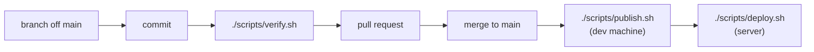

# Git — spec

**Verified against:** `1c70c28a`, 2026-08-28\
**Scope:** branching, commits, pull requests, the verification gate, and the GitHub settings that enforce them

| Section                                                | Answers                                                                    |
| ------------------------------------------------------ | -------------------------------------------------------------------------- |
| [1.1 The pipeline](#11-the-pipeline)                   | What happens between an idea and production, and in which order            |
| [1.2 Branching](#12-branching)                         | What a branch is named and how long it lives                               |
| [1.3 Commits](#13-commits)                             | What a subject and a body must contain, and what refuses one               |
| [1.4 Pull requests](#14-pull-requests)                 | How a change reaches `main`, and what only the body can carry              |
| [1.5 The verification gate](#15-the-verification-gate) | Which scopes exist, what each proves, and when a partial run is not enough |
| [1.6 Repository settings](#16-repository-settings)     | The unversioned GitHub configuration, and how to restore it                |
| [2. Invariants](#2-invariants)                         | The properties that must hold                                              |
| [3. Violation → remedy](#3-violation--remedy)          | A symptom, its cause, and what to do about it                              |
| [4. Known-open](#4-known-open)                         | What is deliberately unfinished                                            |

---

## 1. Contract

### 1.1 The pipeline



Two gaps in that chain are deliberate. **Images are built on the development machine, never on the
server** — a server that builds is a server that can fail a build, at the worst moment, with the site
down. **Merging does not deploy**: publishing and deploying are separate manual steps, and there is no
automation between `main` and production.

**Order a data change against the deployed image, never against `main`.** `main` routinely describes
a service that is not running, and `./scripts/deploy.sh --status` is what names the live commit.

Everything up to the merge is dev (Windows, Git Bash); publishing is dev and deploying is the server.

### 1.2 Branching

`main` is the only long-lived branch. There is no `develop`, no release branches, and no long-running
feature branches. Work happens on short-lived topic branches cut from `main`, named in kebab-case for
the change itself, with **no prefix taxonomy** — no `feature/`, `fix/`, `chore/`.

```bash
git checkout main
git pull --ff-only origin main
git checkout -b short-kebab-name
```

**A branch that lives for days merges `main` into itself continuously.** One touching shared
documentation conflicts on every shared page, and the cost compounds until it is paid.

**A merge resolution needs a no-loss assertion, not care.** Enumerate every line each side added
since the fork and prove none is absent from the result. Taking one side whole is how a heading, a
clause and an edited line each disappeared while the result read correctly.

**`--ff-only` on the way back down is the point.** Because every change reaches `main` through GitHub,
local `main` is only ever strictly behind, so a fast-forward is always possible. Where it is not,
`--ff-only` refuses instead of inventing a merge commit — which is exactly the moment to stop and
look.

### 1.3 Commits

The convention is consistent across the whole history and is **not** Conventional Commits.

**Subject:** `Scope: what changed` — sentence case after the scope, no trailing period, the scope taken
from the table in [`templates.md`](templates.md). Subjects are **declarative rather
than imperative**. A two-clause subject joined by ", and" names one commit's two related changes.

**Body:** prose, wrapped at roughly 76 characters, in paragraphs each led by the area it concerns.
Four things a body carries that the diff cannot:

- **why**, never what — the diff shows what
- **what was verified, and how**
- **where a prior assumption turned out to be wrong**
- **the rejected alternative**, where there was one

No issue-closing keywords, no emoji, no trailers — except a closing paragraph that is sign-offs and
nothing else, which is what Dependabot's generator always writes and the only trailer form the
checker releases, on an exact author identity (`scripts/check_commits.py :: BOT_IDENTITIES`, and
[`templates.md`](templates.md) for what else that identity releases there). Work is never signed as
AI-generated, which overrides any tool default appending a `Co-Authored-By` line.

**None of that rests on memory.** `scripts/check_commits.py` refuses a malformed message as a
`commit-msg` hook when you write it, in the `--docs` gate scope before you push, and in CI on every
pull request. It reads the branch's own commits, never history, which predates the convention.
`git config core.hooksPath .githooks` installs the hook, and **a fresh clone has none until that is
run** — until then the gate and CI are the only checks.

[`templates.md`](templates.md) holds the form and what the checker refuses outright.
Beyond that list:

- A non-blank second line is refused — git otherwise reads the whole message as the subject.
- A subject longer than GitHub shows in a list view is reported, not refused
  (`scripts/check_commits.py :: SUBJECT_TARGET`).
- A scope outside the recorded set is reported, not refused.
- A body recording no verification is reported, not refused — and not reported at all for a commit
  Dependabot wrote, whose generator records none and has no way to.
- Merge and revert subjects are skipped — they are git's.
- Nothing else is released for a bot: the subject's shape and its length tiers, the scope vocabulary,
  the emoji, issue-closing and AI-signature bans, and every trailer but the sign-off all answer for
  Dependabot as for anyone — I4 included, so a bot commit with no body is still refused.

### 1.4 Pull requests

Every change reaches `main` through a pull request, merged with a **merge commit** — not squash, not
rebase. **The commit bodies are the documentation**: squashing collapses several carefully written
bodies into one and loses the structure, and rebasing discards the merge point that groups them.

**Every pull request a person opens is opened as a draft.** A draft runs CI exactly as a ready one
does and **cannot be merged until it is marked ready**. Marking ready and merging are **mine, and only
mine**. The rule is a convention, and a convention reaches only what reads one:
`.github/dependabot.yml` carries no draft setting, so a bot's pull request arrives ready and its
review is the merge button rather than the ready button.

```bash
git push -u origin short-kebab-name
gh pr create --draft --title "Scope: what changed" --body-file <path>
```

`gh` is installed and authenticated, and the boundary is:

| Run                                                            | Never run                          |
| -------------------------------------------------------------- | ---------------------------------- |
| `gh pr create --draft` — opening one, always in this form      | `gh pr create` without `--draft`   |
| `gh pr view`, `gh pr checks`, `gh run view` — reading anything | `gh pr ready` — that is the review |
| `gh pr edit --body-file` — correcting a body after a change    | `gh pr merge`                      |

**Editing beats reopening.** Pushing another commit updates an open pull request in place, and
`gh pr edit` rewrites the title and body without touching anything else; the number and the URL survive
both. The only expensive change is rewriting the branch's own commits, which moves every line a review
comment is anchored to.

**Title:** the same shape as a commit subject. For a single-commit pull request, the commit subject
verbatim.

**Body: a summary of the branch, never an index of its commits.** A single-commit pull request gets
a pointer, because the commit body already says it; a multi-commit one opens with an orientation
sentence and then summarises at the level no commit reaches. Two things only the body can carry,
which is why the template's headings are what they are: what was verified and how, and anything
deliberately left undone.

**A body must stand alone.** `docs/audit/` is gitignored, so a reviewer sees none of it — never point
at anything under it from a body.

### 1.5 The verification gate

```bash
./scripts/verify.sh
```

Scopes run concurrently, and `verify.sh` replays their output in cheapest-to-fail order, so a parallel
run reads as a serial one. A bare invocation runs everything; scope flags name surfaces and combine.
The scope table, what each scope runs and what it needs, the `--serial` oracle that ordering is
measured against, the diff check that refuses an undersized scope and the CI job mapping are all in
[`../ops/spec.md`](../ops/spec.md) §1.6, which owns `scripts/`.

> **`pnpm format` covers the whole repository.** It runs prettier over the repository root under the
> root `.prettierrc.json`, and what stays out is decided by one ignore file, `.prettierignore` beside
> it. There is no path list to keep in step, so moving, renaming or adding a file cannot make the
> formatter fail on a path that is not there. **Verify with a gate run whose scope includes the
> formatter — `./scripts/verify.sh --format`, or any run that implies it, such as `--frontend` or
> `--quick` — never with a hand-written `prettier` command**, which covers the paths you happen to
> remember. In CI the `format` job runs the check for changes outside `fl_frontend`.

> **When bumping an action, resolve the version to a commit SHA and pin that, never the tag.**
> `gh api repos/<owner>/<repo>/git/ref/tags/<tag>` names the object the tag points at. Where that
> object is itself a tag rather than a commit — an annotated tag — dereference it with
> `gh api repos/<owner>/<repo>/git/tags/<object-sha>`: the SHA of the tag object is not the SHA of
> any commit, so a pin holding it resolves to nothing on a runner, and the ref API hands it over
> without complaint. Then read the action's metadata at the SHA you are about to write,
> `gh api repos/<owner>/<repo>/contents/<subdir>/action.yml?ref=<sha>` — a version that does not
> exist has no tree to read it from. `<subdir>` is whatever the `uses:` line carries after the
> repository name, and is empty at the repository root: `github/codeql-action/init` reads
> `init/action.yml`, while the bare `action.yml` at that repository's root describes a different
> action and returns 200 all the same. Release _pages_ render dynamically and summarise unreliably.
> The first CI run failed instantly on `astral-sh/setup-uv@v9`, a version that has never existed,
> taken from a bad reading of a release page.

### 1.6 Repository settings

**Written down because nothing else records them** — GitHub offers no export, and deleting a
repository destroys them. Read from the live repository on 2026-08-09. The ruleset is a single branch
ruleset targeting the default branch, enforcement **Active**.

| Setting                               | Value                                                                  | Panel                        |
| ------------------------------------- | ---------------------------------------------------------------------- | ---------------------------- |
| Allow merge commits                   | on                                                                     | General → Pull Requests      |
| Allow squash merging                  | **off**                                                                | General → Pull Requests      |
| Allow rebase merging                  | **off**                                                                | General → Pull Requests      |
| Automatically delete head branches    | on                                                                     | General → Pull Requests      |
| Restrict deletions                    | on                                                                     | Rules → Rulesets             |
| Block force pushes                    | on                                                                     | Rules → Rulesets             |
| Require a pull request before merging | on, required approvals **`0`**                                         | Rules → Rulesets             |
| Require status checks to pass         | on — **`verify`**, **`backend-db`**, **`pr-body`**                     | Rules → Rulesets             |
| Require branches up to date to merge  | **off** — read 2026-08-11                                              | Rules → Rulesets             |
| Require linear history                | **off**                                                                | Rules → Rulesets             |
| Bypass list                           | **empty**                                                              | Rules → Rulesets             |
| Actions permissions                   | GitHub-authored, plus `pnpm/action-setup@*` and `astral-sh/setup-uv@*` | Actions → General            |
| Fork pull request workflows           | require approval for all outside collaborators                         | Actions → General            |
| Default workflow permissions          | read-only; Actions may not create or approve pull requests             | Actions → General            |
| Secret scanning, push protection      | on                                                                     | Security → Advanced Security |
| Dependabot alerts, security updates   | on                                                                     | Security → Advanced Security |
| Code scanning                         | advanced setup; `.github/workflows/codeql.yml` is what enables it      | Security → Advanced Security |

Locally, `git branch -d short-kebab-name` after the pull. The traps attached to those values:

- **Required approvals stays `0`** — a single maintainer cannot approve their own pull request, so
  any higher value blocks every merge permanently.
- **Linear history stays off** — it forbids merge commits, and squash and rebase are already off.
- **The bypass list stays empty** — the force-push it guards against is my own, so an exemption
  exempts exactly the risk. A deliberate history rewrite is done by setting the ruleset to
  **Disabled**, doing it, and re-enabling.
- **CodeQL is deliberately not a required check** — it reports more than one, and an upstream
  query-pack problem would block merges for a reason unrelated to the change.
- **Each required check is added by hand in this panel**, so a new workflow reports until someone
  adds it here. `verify` is `.github/workflows/verify.yml`'s aggregate job and `backend-db` a
  separate job of the same workflow; `pr-body` holds the body to the form in
  [`templates.md`](templates.md) and is its own workflow because it listens for `edited` —
  subscribing `verify.yml` to that event would rebuild both images every time a description gained a
  comma.
- **"Require branches up to date to merge" stays off**
  (`strict_required_status_checks_policy`, read through
  `gh api repos/<owner>/<repo>/rules/branches/main`). A required check therefore passes against a
  commit that predates `main`'s tip, so a green run proves the branch rather than the merge result.
  Turning it on forces every open pull request to re-run after each base move, which the `images`
  job makes expensive.
- **An action living in this repository needs no allowlist entry** — every action under
  `.github/actions/` is read from the checkout.
- **Every action is pinned to a full commit SHA**, with the version in a trailing comment — the form
  Dependabot rewrites, so a routine upstream patch still arrives as a pull request that moves the
  pin and the comment together. An exact version tag is not enough: a tag is a mutable ref, so a
  compromised upstream can repoint the tag every caller already trusts and nothing in this
  repository changes. **The pin also costs the alert route**: Dependabot raises no advisory alert
  for an action pinned to a SHA, so the scheduled version-update run in `.github/dependabot.yml` is
  this repository's whole coverage for a vulnerable action, and a published advisory waits for it. A
  local `./` action needs no pin, and the pins **inside** one are watched only because
  `.github/dependabot.yml` names the composite-action directory separately (COR-2).
- **Every workflow triggers on `pull_request`, never `pull_request_target`**, so a fork's run
  receives no secrets and no write token. Each declares its own `permissions:` block, and the
  read-only default is what one that forgets inherits.
- **Secret scanning matches known provider token formats**, so it catches neither
  `INTERNAL_API_KEY_*` nor `AUTH_SECRET`. What protects those is `.env*` being gitignored and
  excluded from both Docker build contexts.
- **The Dependabot toggles are separate from `.github/dependabot.yml`**, which governs only routine
  monthly version updates; without them a published advisory produces no notification at all. Version
  updates need no toggle of their own — that file's presence on the default branch enables them.
- **Do not use code scanning's "Set up" button**: it writes a second, competing default configuration
  through the web editor.

## 2. Invariants

| #   | Invariant                                                     | Enforced by                                           |
| --- | ------------------------------------------------------------- | ----------------------------------------------------- |
| I1  | `main` takes changes only through a pull request              | the ruleset                                           |
| I2  | Merge commits are the only permitted merge method             | Settings → General, and linear history off            |
| I3  | Every pull request a person opens is opened as a draft        | convention; a draft cannot be merged                  |
| I4  | Every commit on a branch carries a body                       | `scripts/check_commits.py`                            |
| I5  | No commit is signed as AI-generated                           | `scripts/check_commits.py :: BANNED`                  |
| I6  | The gate's scope is checked against the diff before it runs   | `scripts/check_scope.py`                              |
| I7  | Required status checks are added by hand in the ruleset panel | the ruleset                                           |
| I8  | Every action is pinned to a full commit SHA                   | review of `.github/workflows/` and `.github/actions/` |
| I9  | Every workflow triggers on `pull_request`                     | `.github/workflows/`                                  |
| I10 | The ruleset's bypass list is empty                            | the ruleset                                           |

## 3. Violation → remedy

| Symptom                                                  | Cause                                                                                                                       | Remedy                                                                                                 |
| -------------------------------------------------------- | --------------------------------------------------------------------------------------------------------------------------- | ------------------------------------------------------------------------------------------------------ |
| `remote rejected ... repository rule violations` on push | The ruleset: `main` takes changes only through a pull request                                                               | Mark the commits on a branch, rewind local `main`, push the branch — the commands are under this table |
| `git pull` refuses to fast-forward                       | Local `main` has drifted                                                                                                    | Stop and look. `--ff-only` failing is the signal, not the problem                                      |
| The gate refuses a run naming too few scopes             | The branch touches a packaging path                                                                                         | Run the full form, images included                                                                     |
| The gate reports surfaces it did not prove               | A scoped run mid-work                                                                                                       | Expected. Report it rather than suppressing it                                                         |
| A commit is refused by the `commit-msg` hook             | No body, an unwrapped line, a malformed subject, a trailer                                                                  | Rewrite the message to [`templates.md`](templates.md); `git commit -F` recovers a draft                |
| A pull request check named `pr-body` fails               | The body indexes commits instead of summarising                                                                             | Rewrite the body; `gh pr edit --body-file` updates it in place                                         |
| A merge button is greyed out with every check green      | The pull request is still a draft                                                                                           | Marking it ready is the review, and it is mine                                                         |
| CI fails instantly on an action reference                | The pin resolves to nothing — a version that never existed, or an annotated tag's own object instead of the commit under it | Resolve the tag to its commit and read `action.yml` at that SHA before writing the pin (§1.5)          |

**Recovering commits already made on local `main`:**

```bash
git branch short-kebab-name        # mark the commits FIRST, or the rewind below strands them
git reset --hard origin/main       # rewind local main to the remote -- discards the working tree
git push -u origin short-kebab-name
```

`reset --hard` belongs only to a `main` certainly holding nothing of value, and the `git branch` line
is what makes that true.

## 4. Known-open

| Item                                                   | State                                                                                                                  |
| ------------------------------------------------------ | ---------------------------------------------------------------------------------------------------------------------- |
| Deployment is manual, and merging does not trigger it  | Deliberate. The gap between merged and live is worth more than the automation on a site I own and operate alone        |
| Repository settings are unversioned                    | GitHub offers no export. §1.6 is the only record, and it is checked by re-reading, never by a gate                     |
| The `--ops` scope alone omits the commit-message check | CI closes the gap by running the check in the always-on `changes` job, since a commit message has no path to filter on |
