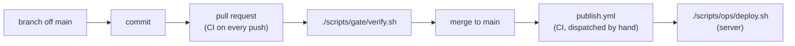

# Git — spec

**Scope:** branching, commits, pull requests, the verification gate, and the GitHub settings that enforce them

| Section                                                | Answers                                                                                        |
| ------------------------------------------------------ | ---------------------------------------------------------------------------------------------- |
| [1.1 The pipeline](#11-the-pipeline)                   | What happens between an idea and production, and in which order                                |
| [1.2 Branching](#12-branching)                         | What a branch is named and how long it lives                                                   |
| [1.3 Commits](#13-commits)                             | What a subject and a body must contain, and what refuses one                                   |
| [1.4 Pull requests](#14-pull-requests)                 | How a change reaches `main`, and what only the body can carry                                  |
| [1.5 The verification gate](#15-the-verification-gate) | Which scopes exist, what each proves, and which run a pull request is called ready to merge on |
| [1.6 Repository settings](#16-repository-settings)     | The unversioned GitHub configuration, and how to restore it                                    |
| [2. Invariants](#2-invariants)                         | The properties that must hold                                                                  |
| [3. Violation → remedy](#3-violation--remedy)          | A symptom, its cause, and what to do about it                                                  |
| [4. Known-open](#4-known-open)                         | What is deliberately unfinished                                                                |

---

## 1. Contract

### 1.1 The pipeline



Two gaps in that chain are deliberate. **Images are built by CI, never on the server** — a server
that builds is a server that can fail a build, at the worst moment, with the site down — and only
from a `main` commit whose own `verify` run passed. **Merging does not deploy**: publishing
(`gh workflow run publish.yml --ref main`) and deploying are separate manual steps.

**Order a data change against the deployed image, never against `main`.** `main` routinely describes
a service that is not running, and `./scripts/ops/deploy.sh --status` is what names the live commit.

Every step the diagram places on a development machine runs on Windows, in Git Bash.

### 1.2 Branching

`main` is the only long-lived branch. Work happens on short-lived topic branches cut from `main`,
named in kebab-case for the change itself, with **no prefix taxonomy** — no `feature/`, `fix/`,
`chore/`.

```bash
git checkout main
git pull --ff-only origin main
git checkout -b short-kebab-name
```

**`.githooks/pre-commit` refuses a commit on `main`**, the one a forgotten branch makes, and is
convenience rather than the enforcement. A clone without §1.3's `core.hooksPath` line has no hook;
on `main`, a clean merge, cherry-pick or revert runs none, and a rebase passes it even through a
conflict. Each of those meets the ruleset's refusal at the push (I1).

**A branch that lives for days merges `main` into itself continuously.** One touching shared
documentation conflicts on every shared page, and the cost compounds until it is paid.

**A merge resolution needs a no-loss assertion, not care.** Enumerate every line each side added
since the fork and prove none is absent from the result. Taking one side whole drops a heading, a
clause or an edited line while the result still reads correctly.

**`--ff-only` on the way back down is the point.** Every change reaches `main` through GitHub, so
local `main` is only ever strictly behind and a fast-forward is always possible; where it is not,
`--ff-only` refuses instead of inventing a merge commit.

### 1.3 Commits

The convention is **not** Conventional Commits.

**Subject:** `Scope: what changed` — sentence case after the scope, no trailing period, the scope taken
from the table in [`templates.md`](templates.md). Subjects are **declarative rather
than imperative**. A two-clause subject joined by ", and" names one commit's two related changes.

**Body:** prose, wrapped at roughly 76 characters, in paragraphs each led by the area it concerns.
Four things a body carries that the diff cannot:

- **why**, never what — the diff shows what
- **what was verified, and how**
- **where a prior assumption turned out to be wrong**
- **the rejected alternative**, where there was one

No issue-closing keywords and no emoji. **One trailer kind, `Closes: <token>`**, one line per
roadmap entry the commit retires, in the last paragraph where git reads a trailer at all and with
nothing else in that paragraph — the lines and the entries the diff retires are compared as sets, so
a commit retiring two carries two and one carrying a line it did not retire is refused alike, and a
line written twice is refused on its own, one member of that set saying nothing about the second
copy. It is **required** of a commit whose diff retires an entry — a heading it removes from the
roadmap and does not put back — and **refused** of a commit whose diff retires none, the second half
being what stops the convention drifting back toward general-purpose trailers. The token is the
entry's own id and nothing else validates (`scripts/checks/check_commits.py :: CLOSES_RE`): **a
serial id in that position is a mistake rather than an older spelling**, and the checker says so.
**The hyphen in it is load-bearing** — it is what parts a token from the eight bare alphanumerics
ordinary code spells for its own reasons, and so what makes `git grep <token>` a uniqueness proof
and the corpus-wide id registry (`scripts/checks/docs_gate/kernel.py :: roadmap_ids`) able to
exclude the unhyphenated shape.

**An entry that ends only partly done is rewritten rather than deleted**, and the commit doing that
carries no trailer ([`../_roadmap/protocol.md`](../_roadmap/protocol.md) §3).

Work is never signed as AI-generated, which overrides any tool default appending a
`Co-Authored-By` line.

**The `commit-msg` hook is the only reader of a message.** Commits are never rewritten, so a
message is correct before it is committed or stays wrong, and a finding against one already pushed
is corrected in the pull request body. `git config core.hooksPath .githooks` installs the hook, with
every other hook in that folder, and it runs `scripts/checks/check_commits.py`. The checker judges
the whole message and, for the `Closes:` trailer, the staged diff
(`scripts/checks/check_commits.py :: staged_departures`), which is the new commit's own diff for a
plain commit, for `git commit -C <sha>` or `-F` after `git cherry-pick -n` — the landing flow, so a
commit is judged in full when it becomes permanent — and for a commit after
`git reset --soft HEAD~1`. It refuses on a failure, and prints each finding the list below marks
_reported_ as a notice on a message it lets through, the one moment a notice can still be acted on.

**What the hook never sees:** a committing `git cherry-pick` without `-n` and a non-interactive
`git rebase`, neither of which runs it; a commit made on GitHub, Dependabot's among them; a clone
that never set `core.hooksPath`; and a commit made with `--no-verify`. **Under
`git commit --amend` the staged diff is the amend's delta against the commit being replaced**, and
nothing git hands the hook tells an amend apart from a plain commit, so an amend of a closing commit
is refused as carrying a spurious trailer. The refusal names its own route, `git reset --soft
HEAD~1` then `git commit -F`, which stages the whole change against the parent.

[`templates.md`](templates.md) holds the form and what the checker refuses outright.
Beyond that list:

- A non-blank second line is refused — git otherwise reads the whole message as the subject.
- A subject longer than GitHub shows in a list view is reported
  (`scripts/checks/check_commits.py :: SUBJECT_TARGET`); one longer still, past the width at which nothing
  wrapped it for any view, is refused instead (`scripts/checks/check_commits.py :: LINE_MAX`).
- A scope outside the recorded set is reported, not refused.
- A trailer line with no blank line over it is refused where it stands
  (`scripts/checks/check_commits.py :: GLUED_TRAILER_RE`). Glued to the prose above it the line is
  prose to git, so the paragraph is no trailer block at all and every arm reading that block — the
  three comparing the message to the diff included — sees an absent trailer rather than a broken
  one.
- A body recording no verification is reported, not refused.
- A message git is composing — a merge's, or a `git revert --no-commit`'s — is skipped: it is git's.

### 1.4 Pull requests

Every change reaches `main` through a pull request, merged with a **merge commit** — not squash, not
rebase. **The commit bodies are the documentation**: squashing collapses several carefully written
bodies into one and loses the structure, and rebasing discards the merge point that groups them.

**Every pull request a person opens is opened as a draft.** A draft runs CI exactly as a ready one
does and **cannot be merged until it is marked ready**. Marking ready and merging are **mine, and only
mine**. The rule is a convention, and a convention reaches only what reads one:
`.github/dependabot.yml` carries no draft setting, so a bot's pull request arrives ready and its
review is the merge button rather than the ready button.

```bash
git push -u origin short-kebab-name
gh pr create --draft --title "Scope: what changed" --body-file <path>
```

`gh` is installed and authenticated, and the boundary is:

| Run                                                            | Never run                          |
| -------------------------------------------------------------- | ---------------------------------- |
| `gh pr create --draft` — opening one, always in this form      | `gh pr create` without `--draft`   |
| `gh pr view`, `gh pr checks`, `gh run view` — reading anything | `gh pr ready` — that is the review |
| `gh pr edit --body-file` — correcting a body after a change    | `gh pr merge`                      |

**Editing beats reopening**: another commit and `gh pr edit` both update an open pull request in
place. The one expensive change is rewriting the branch's own commits, which moves every line a
review comment is anchored to.

**Title:** the same shape as a commit subject. For a single-commit pull request, the commit subject
verbatim.

**Body: a summary of the branch, never an index of its commits.** A single-commit pull request gets
a pointer, because the commit body already says it; a multi-commit one opens with an orientation
sentence and then summarises at the level no commit reaches. Two things only the body can carry:
what was verified and how, and anything deliberately left undone.

**A body must stand alone.** `docs/audit/` is gitignored, so a reviewer sees none of it — never point
at anything under it from a body.

### 1.5 The verification gate

```bash
./scripts/gate/verify.sh
```

A bare invocation runs everything, and it is the run a pull request is called ready to merge on
(`.claude/CLAUDE.md` §2); scope flags name surfaces and combine, for iterating. The scope table, what each scope runs and what it needs, the `--serial`
oracle that its ordering is measured against and the CI job mapping are all in
[`../ops/spec.md`](../ops/spec.md) §1.6, which owns `scripts/`.

> **Verify formatting with a gate run whose scope includes the formatter —
> `./scripts/gate/verify.sh --format`, or any run that implies it, such as `--frontend` or
> `--quick` — never with a hand-written `prettier` command**, which covers the paths you happen to
> remember. `pnpm format` reaches the whole repository, and one ignore file decides what stays out
> ([`../ops/spec.md`](../ops/spec.md) §1.6).

> **When bumping an action, resolve the version to a commit SHA and pin that, never the tag.**
> `gh api repos/<owner>/<repo>/git/ref/tags/<tag>` names the object the tag points at. Where that
> object is itself a tag rather than a commit — an annotated tag — dereference it with
> `gh api repos/<owner>/<repo>/git/tags/<object-sha>`: the SHA of the tag object is not the SHA of
> any commit, so a pin holding it resolves to nothing on a runner, and the ref API hands it over
> without complaint. Then read the action's metadata at the SHA you are about to write,
> `gh api repos/<owner>/<repo>/contents/<subdir>/action.yml?ref=<sha>` — a version that does not
> exist has no tree to read it from. `<subdir>` is whatever the `uses:` line carries after the
> repository name, and is empty at the repository root: `github/codeql-action/init` reads
> `init/action.yml`, while the bare `action.yml` at that repository's root describes a different
> action and returns 200 all the same. Release _pages_ render dynamically and summarise unreliably.

### 1.6 Repository settings

**Written down because nothing else records them** — GitHub offers no export, and deleting a
repository destroys them. Every row mirrors a live panel that moves without us, so a row is only as
current as the commit that last wrote it, which `git blame` names. The ruleset is a single branch
ruleset targeting the default branch, enforcement **Active**.

| Setting                               | Value                                                                                                                                                                                                     | Panel                        |
| ------------------------------------- | --------------------------------------------------------------------------------------------------------------------------------------------------------------------------------------------------------- | ---------------------------- |
| Allow merge commits                   | on                                                                                                                                                                                                        | General → Pull Requests      |
| Allow squash merging                  | **off**                                                                                                                                                                                                   | General → Pull Requests      |
| Allow rebase merging                  | **off**                                                                                                                                                                                                   | General → Pull Requests      |
| Automatically delete head branches    | on                                                                                                                                                                                                        | General → Pull Requests      |
| Restrict deletions                    | on                                                                                                                                                                                                        | Rules → Rulesets             |
| Block force pushes                    | on                                                                                                                                                                                                        | Rules → Rulesets             |
| Require a pull request before merging | on, required approvals **`0`**                                                                                                                                                                            | Rules → Rulesets             |
| Require status checks to pass         | on — **`verify`**, **`db`**, **`pr-body`**                                                                                                                                                                | Rules → Rulesets             |
| Require branches up to date to merge  | **off**                                                                                                                                                                                                   | Rules → Rulesets             |
| Require linear history                | **off**                                                                                                                                                                                                   | Rules → Rulesets             |
| Bypass list                           | **empty**                                                                                                                                                                                                 | Rules → Rulesets             |
| Actions permissions                   | GitHub-authored, plus `pnpm/action-setup@*`, `pnpm/setup@*`, `astral-sh/setup-uv@*`, `docker/setup-buildx-action@*`, `docker/login-action@*`, `docker/metadata-action@*` and `docker/build-push-action@*` | Actions → General            |
| Require actions pinned to a SHA       | **off** — recommended on, see below                                                                                                                                                                       | Actions → General            |
| Fork pull request workflows           | require approval for all outside collaborators                                                                                                                                                            | Actions → General            |
| Default workflow permissions          | read-only; Actions may not create or approve pull requests                                                                                                                                                | Actions → General            |
| Secret scanning, push protection      | on                                                                                                                                                                                                        | Security → Advanced Security |
| Dependabot alerts, security updates   | on                                                                                                                                                                                                        | Security → Advanced Security |
| Code scanning                         | advanced setup; `.github/workflows/codeql.yml` is what enables it                                                                                                                                         | Security → Advanced Security |

Locally, `git branch -d short-kebab-name` after the pull. The traps attached to those values:

- **Required approvals stays `0`** — a single maintainer cannot approve their own pull request, so
  any higher value blocks every merge permanently.
- **Linear history stays off** — it forbids merge commits, and squash and rebase are already off.
- **The bypass list stays empty** — the force-push it guards against is my own, so an exemption
  exempts exactly the risk. A deliberate history rewrite is done by setting the ruleset to
  **Disabled**, doing it, and re-enabling.
- **CodeQL is deliberately not a required check** — it reports more than one, and an upstream
  query-pack problem would block merges for a reason unrelated to the change.
- **Each required check is added by hand in this panel**, so a new workflow reports until someone
  adds it here. `pr-body` is its own workflow rather than a job of `verify.yml` because it listens
  for `edited` — subscribing `verify.yml` to that event would rebuild both images every time a
  description gained a comma.
- **"Require branches up to date to merge" stays off**
  (`strict_required_status_checks_policy`, read through
  `gh api repos/<owner>/<repo>/rules/branches/main`). A required check therefore passes against a
  commit that predates `main`'s tip, so a green run proves the branch rather than the merge result.
  Turning it on forces every open pull request to re-run after each base move, which the `images`
  job makes expensive.
- **An action living in this repository needs no allowlist entry** — every action under
  `.github/actions/` is read from the checkout.
- **The allowlist names every third-party action a `uses:` line reaches**, a line inside a local
  composite action included, which is how `pnpm/setup@*` gets there; the panel entry is added first
  and the workflow second, and nothing in the repository compares the two lists.
- **"Require actions to be pinned to a full-length commit SHA" is worth turning on, and is not.**
  Read as `sha_pinning_required: false` through
  `gh api repos/<owner>/<repo>/actions/permissions`, which is also the only route that reads it
  back. It costs nothing today — every `uses:` naming a repository already carries a full SHA, so
  enabling it changes no run — and it is what makes the next one that does not fail at the platform
  rather than at review. It is separate from the allowlist above, which decides _which_ actions may
  run rather than how they are referenced, so both still apply. Turning it on is a panel action, and
  it is mine.
- **Every action is pinned to a full commit SHA**, with the version in a trailing comment — the form
  Dependabot rewrites, so a routine upstream patch still arrives as a pull request that moves the
  pin and the comment together. An exact version tag is not enough: a tag is a mutable ref, so a
  compromised upstream can repoint the tag every caller already trusts and nothing in this
  repository changes. **The pin also costs the alert route**: Dependabot raises no advisory alert
  for an action pinned to a SHA, so the scheduled version-update run in `.github/dependabot.yml` is
  this repository's whole coverage for a vulnerable action, and a published advisory waits for that
  run, which is what buys that one ecosystem a shorter interval than the rest. A
  local `./` action needs no pin, and the pins **inside** one are watched only because
  `.github/dependabot.yml` names the composite-action directory separately (COR-2).
- **Routine dependency updates are shaped by noise, not by coverage**, and the policies below hold
  across every ecosystem block in `.github/dependabot.yml` rather than belonging to any one of them.
  Ungrouped weekly updates everywhere would open dozens of pull requests a month, each running the
  full `verify` gate, and none would be read — so minor and patch bumps are **grouped per ecosystem
  on a monthly interval**, `github-actions` alone weekly for the reason above. A **major stays its
  own pull request**, ungrouped, because those are the ones that need a changelog read. Every
  ecosystem sets the **same cooldown**, so a release compromised at publication can be yanked before
  a pull request proposes it, and its own **commit prefix**, so the messages keep
  [`templates.md`](templates.md)'s shape. The intervals, the cooldown and the prefixes are in that
  file; what is here is why they are the same everywhere.
- **Every workflow a pull request starts triggers on `pull_request`, never `pull_request_target`**,
  so a fork's run receives no secrets and no write token; `publish.yml` is started by hand alone.
  Each declares its own `permissions:` block, and the read-only default is what one that forgets
  inherits.
- **Secret scanning matches known provider token formats**, so it catches neither
  `INTERNAL_API_KEY_*` nor `AUTH_SECRET`. What protects those is `.env*` being gitignored and
  excluded from both Docker build contexts.
- **The Dependabot toggles are separate from `.github/dependabot.yml`**, which governs only routine
  scheduled version updates; without them a published advisory produces no notification at all. Version
  updates need no toggle of their own — that file's presence on the default branch enables them.
- **Do not use code scanning's "Set up" button**: it writes a second, competing default configuration
  through the web editor.

## 2. Invariants

| #   | Invariant                                                       | Enforced by                                           |
| --- | --------------------------------------------------------------- | ----------------------------------------------------- |
| I1  | `main` takes changes only through a pull request                | the ruleset                                           |
| I2  | Merge commits are the only permitted merge method               | Settings → General, and linear history off            |
| I3  | Every pull request a person opens is opened as a draft          | convention; a draft cannot be merged                  |
| I4  | Every commit on a branch carries a body                         | `scripts/checks/check_commits.py`                     |
| I5  | No commit is signed as AI-generated                             | `scripts/checks/check_commits.py :: BANNED`           |
| I7  | Required status checks are added by hand in the ruleset panel   | the ruleset                                           |
| I8  | Every action is pinned to a full commit SHA                     | review of `.github/workflows/` and `.github/actions/` |
| I9  | Every workflow a pull request starts triggers on `pull_request` | `.github/workflows/`                                  |
| I10 | The ruleset's bypass list is empty                              | the ruleset                                           |
| I11 | A commit retiring a roadmap entry names it, and only then       | `scripts/checks/check_commits.py :: check_message`    |

## 3. Violation → remedy

| Symptom                                                  | Cause                                                                                                                       | Remedy                                                                                                 |
| -------------------------------------------------------- | --------------------------------------------------------------------------------------------------------------------------- | ------------------------------------------------------------------------------------------------------ |
| `remote rejected ... repository rule violations` on push | The ruleset: `main` takes changes only through a pull request                                                               | Mark the commits on a branch, rewind local `main`, push the branch — the commands are under this table |
| `git pull` refuses to fast-forward                       | Local `main` has drifted                                                                                                    | Stop and look. `--ff-only` failing is the signal, not the problem                                      |
| The gate reports surfaces it did not prove               | A scoped run mid-work                                                                                                       | Expected. Report it rather than suppressing it                                                         |
| A commit is refused by the `commit-msg` hook             | No body, an unwrapped line, a malformed subject, a trailer the convention does not admit                                    | Rewrite the message to [`templates.md`](templates.md); `git commit -F` recovers a draft                |
| An amend of a closing commit is refused                  | Under `git commit --amend` the hook reads the amend's delta, which retires nothing (§1.3)                                   | `git reset --soft HEAD~1`, then `git commit -F` with the same message                                  |
| A pull request check named `pr-body` fails               | The body indexes commits instead of summarising                                                                             | Rewrite the body; `gh pr edit --body-file` updates it in place                                         |
| A merge button is greyed out with every check green      | The pull request is still a draft                                                                                           | Marking it ready is the review, and it is mine                                                         |
| CI fails instantly on an action reference                | The pin resolves to nothing — a version that never existed, or an annotated tag's own object instead of the commit under it | Resolve the tag to its commit and read `action.yml` at that SHA before writing the pin (§1.5)          |
| A job dies at a `uses:` line before any of its steps run | That action is not on the Actions allowlist                                                                                 | Add it in Actions → General and re-run; §1.6 records the list                                          |

**Recovering commits already made on local `main`:**

```bash
git checkout -b short-kebab-name   # the commits and any uncommitted work move to the branch
git branch -f main origin/main     # rewind local main to the remote -- the working tree is untouched
git push -u origin short-kebab-name
```

Nothing here discards anything: `branch -f` moves `main` only because another branch is checked out,
so neither the commits nor the working tree are at risk.

## 4. Known-open

| Item                                                                   | State                                                                                                                  |
| ---------------------------------------------------------------------- | ---------------------------------------------------------------------------------------------------------------------- |
| Deployment is manual, and merging does not trigger it                  | Deliberate. The gap between merged and live is worth more than the automation on a site I own and operate alone        |
| Repository settings are unversioned                                    | GitHub offers no export. §1.6 is the only record, and it is checked by re-reading, never by a gate                     |
| Nothing checks that a commit's frontend imports resolve at that commit | Deliberate. One such commit is a skip (§3); a second reaching `main` is the argument for a per-commit resolution check |
