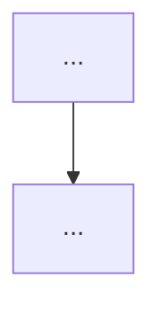

<!--
TEMPLATE — copy to docs/<surface>/overview.md and fill in.
Guidance: ../2-out-of-code.md, "Layer 3 — surface overviews"

AROUND 120 LINES, treated as a ceiling. An overview that is growing has started explaining mechanisms,
and mechanisms belong in the spec sheet.

An overview says what the surface is for, names its major parts, and links onward. It does not explain
mechanisms (spec sheet) and it does not argue (ADR).

The relative links in "Read next" resolve once this file sits at docs/<surface>/overview.md. They do
not resolve here, in the template. That is expected.

Delete this comment block.
-->

# <Surface> — overview

**Verified against:** `<commit>`, `<date>`

Two or three sentences: what this surface is, and the one structural fact that explains most of its
shape. Lead with the thing a reader would otherwise get wrong.

## How it is organised

A short paragraph naming the major parts and the boundaries between them. Mention what is enforced
mechanically (a lint rule, a type) versus what is convention, because a reader needs to know which
constraints will fail loudly.

Where a rule has a deliberate exception, name it here and cite the ADR — an unexplained exception reads
as a mistake and gets "fixed".

## Diagram

A mermaid C4 container or component diagram, where one earns its place. Levels 1–3 only; no code
diagrams (DS10). Skip this section entirely if prose is clearer.

## Read next

- [`spec.md`](spec.md) — contracts and invariants
- [`../glossary.md`](../glossary.md) — domain vocabulary
- Relevant ADRs, by number and title
