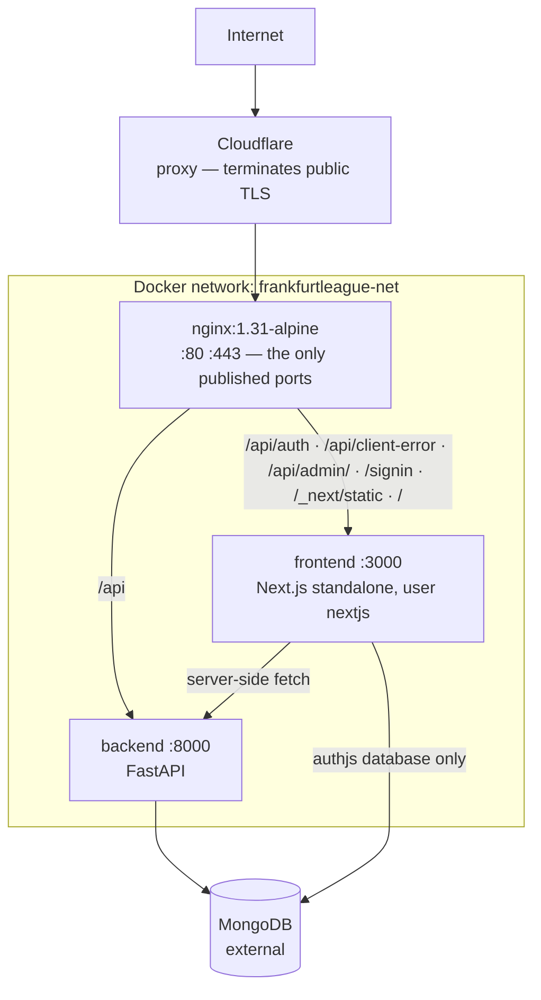

# Ops — overview

**Verified against:** `cda2912d`, 2026-08-19\
**Scope:** `docker-compose*.yml`, `nginx/`, `scripts/`, both Dockerfiles

Three containers behind nginx on one host, deployed by pulling published images. There is no
orchestrator, no CI runner and no build on the server — deliberately, because a server that builds is a
server that can fail a build.

> **[`spec.md`](spec.md) is the operational manual** — every script, every gate scope, the tag scheme,
> the conventions and a troubleshooting table; [`runbooks.md`](runbooks.md) holds the recurring
> procedures. This page does not repeat either. What follows is the topology and the
> constraints they assume.

## How it is organised

**The two arrows into MongoDB are two different database users** (2026-08-02). The backend authenticates
as one holding `readWrite` and `collMod` on the application database alone; Auth.js authenticates as a
separate one holding `readWrite` on `authjs` alone. Neither can reach the other's data, and neither
holds a `*AnyDatabase` role. `collMod` is on the backend's user because it applies the database's own
validators on every boot — what a user without it produces is the `collMod` row of
[`../backend/spec.md`](../backend/spec.md) §4.

The split is required, not incidental. Auth.js reaching **its own** database is the one sanctioned
direct reach from the frontend into MongoDB; application data goes through FastAPI without exception
([`../frontend/overview.md`](../frontend/overview.md)). **Never give the two a shared login** — that
makes the boundary a matter of trust rather than of configuration, and nothing then enforces it.

**Only nginx publishes ports** ([`spec.md`](spec.md) I1). The two application containers are reachable
solely from inside the compose network, so anything not in nginx's routing table simply does not exist
for the internet.

**A Cloudflare proxy sits in front of nginx**, and none of these consequences is visible from a
configuration file in this repository:

- **A visitor's TLS session terminates at Cloudflare, not at nginx.** The cipher suites, session
  settings and OCSP stapling configured in `nginx/prod.conf` govern the Cloudflare-to-origin hop, not
  what a browser negotiates.
- **An origin failure can surface as a Cloudflare error code**, not as anything nginx logged. A
  rejected TLS handshake at the origin appeared publicly as `525`, which names neither nginx nor the
  server block that caused it.
- **The headers a visitor receives are whatever survives the proxy.** They match `prod.conf` — verified
  2026-08-01, which makes them a property to re-verify rather than assume.
- **Cloudflare compresses what arrives uncompressed and passes through everything else**, and its
  own compression is _worse_ than the origin's on the same file — measured 2026-08-01 at 38.7 KB
  (zstd, what Chrome negotiates) against 35.9 KB. So the origin keeps compressing.

The origin remains the authority for routing, rate limiting and the security headers. Nothing here
manages the Cloudflare account, its DNS records or its SSL mode, so what is configured there cannot be
read from this repository at all.

**Edge settings that are deliberately off** — recorded here because each looks like free performance
and is not, and because what is actually set can be confirmed only in the Cloudflare dashboard:
**Rocket Loader** rewrites and defers script execution, which React hydration and Next's
streaming depend on the ordering of; **Cloudflare Fonts** removes third-party font requests and this
site has none, because `next/font` self-hosts Inter at build time; **Shared Dictionary Compression**
deltas a file against an older version of itself, and every chunk here is content-hashed so a rebuild
produces a new filename rather than a new version. **Early Hints** is the one worth turning on, and
whether it is on is not readable from this repository — the HTML already emits a `Link: rel=preload`
header for the font that Cloudflare can promote to a 103.

## Routing

nginx matches by longest prefix, and the one rule to carry away is that **`/api` goes to the backend
while the more specific `/api` locations do not**: `/api/auth`, `= /api/client-error` and
`/api/admin/` each reach the frontend. The table, with its rate-limit zones and cache headers, is
[`spec.md`](spec.md) §1.3; `nginx/prod.conf` is the source for both.

That is what makes **a frontend route handler unreachable from the internet unless an nginx location
publishes it** — the topology a future internal-only route would be protected by, and the reason adding
a location for one publishes it. FastAPI's Swagger UI is affected the same way: it sits at the app root
(`/docs`), not under `/api`, so the public `/docs` path reaches Next instead, which is why the API
documentation is a development and in-network tool.

## Security posture

The values and the arguments behind them are [`spec.md`](spec.md) §1.3–§1.4 and invariants I2–I4. The
shape:

- **The origin is hardened even though a proxy sits above it** — TLS 1.2/1.3 only, one enforced CSP,
  the security header set, and a `default_server` that rejects an unknown `Host` at TLS time rather
  than forwarding it verbatim to Next ([`spec.md`](spec.md) I3).
- **The public, unauthenticated entry points are rate-limited at the edge**: the sign-in POST, whose
  action id ships in a client chunk, and the client-error ingest — both outbound-effect endpoints
  anyone can call ([`spec.md`](spec.md) I4).
- **`'unsafe-inline'` on `script-src` is deliberate** and its compensating control is the
  `react/no-danger` lint rule — a nonce cannot
  cover build-time prerendered HTML.
- **The two application containers drop all capabilities** and set `no-new-privileges`; the nginx
  container does neither ([`spec.md`](spec.md) §4). The frontend runs as a non-root user, and
  `public/` stays root-owned so the app cannot write to it.

## Images and deployment

Both images are multi-stage. The frontend builds to Next's `standalone` output and runs under `tini`
for signal handling. **The builder stage has no reachable backend and no real environment**
([`spec.md`](spec.md) I5), which is the constraint behind several frontend decisions: anything reaching
the API or constructing a URL from `AUTH_URL` at module scope fails the image build rather than failing
at runtime.

Deployment is `pull` plus in-place container recreation, so the interruption is seconds rather than the
full outage a `down`/`up` cycle would cause ([`spec.md`](spec.md) I6 and I9). nginx waits on **both**
services' health, so an unhealthy deploy is never served. Rollback is pulling a pinned
`:sha-<commit>` tag; the registry is the rollback mechanism.

Each service has its own **public** package on GitHub Container Registry —
`ghcr.io/felzab/frankfurtleague-frontend` and `-backend`. Public is what lets the server pull
anonymously, so production holds no registry credentials at all. Every image carries OCI labels
recording the commit it was built from — which is why `deploy.sh --status` can report the live commit
truthfully even if a tag was moved.

## Environments and secrets

The environments are deliberately separated — dev, local and prod — and the entry point and reach of
each are [`spec.md`](spec.md) §1.5. The one to know before touching packaging: **local** runs the
production image built from the working tree, behind nginx, which makes it the only place a packaging
problem is visible before a deploy.

Both services read a `.env` file supplied by Compose (`fl_frontend/.env`, `fl_backend/.env`); neither
is in the repository. The frontend validates its environment at startup and **fails with variable names
only, never values**. The shared API keys must match on both sides; the length rule and which side
enforces it are [`spec.md`](spec.md) I11.

## Read next

- [`spec.md`](spec.md) — the service contracts and the invariants
- [`runbooks.md`](runbooks.md) — the recurring procedures, and what this repository cannot record about the host
- [`../frontend/overview.md`](../frontend/overview.md) — the application server behind nginx
- [`../backend/overview.md`](../backend/overview.md) — the API it fetches from
