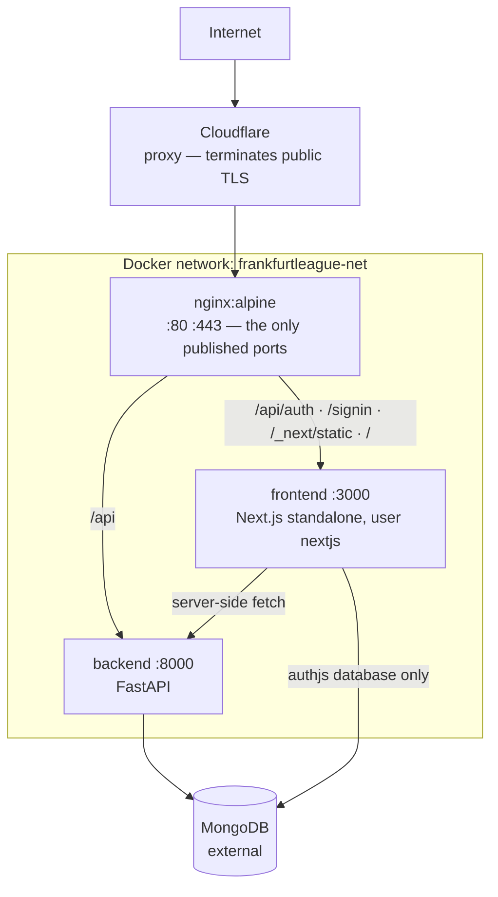

# Ops — overview

**Verified against:** `e340056`, 2026-08-01
**Scope:** `docker-compose*.yml`, `nginx/`, `scripts/`, both Dockerfiles

Three containers behind nginx on one host, deployed by pulling published images. There is no
orchestrator, no CI runner and no build on the server — deliberately, because a server that builds is a
server that can fail a build.

> **`scripts/README.md` is the operational manual** — every script, every flag, the tag scheme, the
> rollback procedure and a troubleshooting table. It is thorough and current; this page does not repeat
> it. What follows is the topology and the constraints that manual assumes.

## Topology

**Only nginx publishes ports.** The two application containers are reachable solely from inside the
compose network, which is what makes `POST /api/revalidate` an internal endpoint without any additional
gate.

**There is a Cloudflare proxy in front, and this page did not say so until 2026-08-01.** It was found
by reading response headers (`Server: cloudflare`, `CF-RAY`) while debugging something unrelated, which
is a poor way to discover a whole tier. Three consequences it is worth stating explicitly, because the
rest of this surface's documentation was written as though requests arrive at nginx directly:

- **A visitor's TLS session terminates at Cloudflare, not at nginx.** The cipher suites, session
  settings and OCSP stapling configured in `nginx/prod.conf` govern the Cloudflare-to-origin hop, not
  what a browser negotiates.
- **An origin failure can surface as a Cloudflare error code**, not as anything nginx logged. A
  rejected TLS handshake at the origin appeared publicly as `525`, which names neither nginx nor the
  server block that caused it.
- **The headers a visitor receives are whatever survives the proxy.** They match `prod.conf` today,
  verified 2026-08-01, but that is now a property to check rather than assume.
- **Cloudflare compresses what arrives uncompressed and passes through everything else.** A response
  that already carries a `Content-Encoding` is cached and served in that encoding forever, so the
  origin gzipping an asset is what decides that the edge will never brotli it. `/_next/static/` is
  therefore served uncompressed and `local.conf` deliberately differs from `prod.conf` here.
  (ADR-0021.) Dynamic HTML is unaffected: it is not cached, and the edge recompresses it (`zstd`).

The origin remains the authority for routing, rate limiting and the security headers; Cloudflare is a
layer above it that this repository does not configure. Nothing here manages the Cloudflare account,
its DNS records or its SSL mode.

**Edge settings that are deliberately off**, recorded because each looks like free performance and is
not: **Rocket Loader** rewrites and defers script execution, which React hydration and Next's
streaming depend on the ordering of; **Cloudflare Fonts** removes third-party font requests and this
site has none, because `next/font` self-hosts Inter at build time; **Shared Dictionary Compression**
deltas a file against an older version of itself, and every chunk here is content-hashed so a rebuild
produces a new filename rather than a new version. **Early Hints** is the one worth having on — the
HTML already emits a `Link: rel=preload` header for the font that it can promote to a 103.

## Routing, and the one rule that matters

nginx matches by longest prefix:

| Location         | Goes to                               |
| ---------------- | ------------------------------------- |
| `/api/auth`      | frontend — Auth.js                    |
| `/api`           | **backend**                           |
| `= /signin`      | frontend, rate-limited on POST        |
| `/_next/static/` | frontend, cached immutably for a year |
| `/`              | frontend                              |

Because `/api` goes to the backend, **the frontend's own route handlers are unreachable from the
internet except under `/api/auth`**. `POST /api/revalidate` depends on exactly this. Adding an nginx
location for it would publish an endpoint that is currently protected by topology.

FastAPI's Swagger UI is affected the same way: it sits at the app root (`/docs`), not under `/api`, so
the public `/docs` path reaches Next instead. The API documentation is a development and in-network
tool.

## Security posture

- **TLS 1.2/1.3 only**, with OCSP stapling and a fixed strong cipher list; client cipher preference.
- **HTTP redirects to HTTPS** and drops the `www.` prefix — and so does a dedicated `www` block on
  443, which is not redundant: HSTS carries `includeSubDomains`, so a returning browser forces
  `https://` on `www` and never sends the plaintext request the port-80 block would have caught.
- **A catch-all `default_server` rejects unknown hosts at TLS time** (`ssl_reject_handshake`). Without
  it, any `Host` header would reach Next — and the proxy forwards the host verbatim. This makes host
  safety independent of the environment file rather than relying on `AUTH_URL` being set.
- **Sign-in POSTs are rate-limited** to 5/minute per IP, GETs unrestricted, via a `map` that produces
  an empty key for non-POST requests (an empty key is exempt). The sign-in action is a public,
  unauthenticated outbound-email trigger whose action id ships in a client chunk, so anyone can POST it.
- **One enforced CSP** for the whole app, set at server level. It keeps `'unsafe-inline'` on
  `script-src`, because a nonce cannot cover build-time prerendered HTML — the targeted control that
  replaces what a nonce policy would have mitigated is the `react/no-danger` lint rule.
- **Containers drop all capabilities** and set `no-new-privileges`. The frontend runs as a non-root
  user, and `public/` stays root-owned so the app cannot write to it.

**A trap worth knowing:** `add_header` inside a `location` block _replaces_ the inherited set rather
than adding to it. The `/_next/static/` block therefore repeats every security header verbatim. If you
add a header at server level, add it there too.

## Images and deployment

Both images are multi-stage. The frontend builds to Next's `standalone` output and runs under `tini`
for signal handling.

**The builder stage has no reachable backend and no real environment**: `SKIP_ENV_VALIDATION=true`, a
placeholder `MONGODB_URI`, and no `API_URL` at all. This is the constraint behind several frontend
decisions — anything that tries to reach the API or construct a URL from `AUTH_URL` at module scope
will fail `docker compose build` rather than fail at runtime.

Deployment is `pull` plus in-place container recreation, so the interruption is seconds rather than the
full outage a `down`/`up` cycle would cause. nginx waits on the frontend's health, so an unhealthy
deploy is never served. Rollback is pulling a pinned `:sha-<commit>` tag; the registry is the rollback
mechanism.

Each service has its own **public** package on GitHub Container Registry —
`ghcr.io/felzab/frankfurtleague-frontend` and `-backend` ([ADR-0017](../_decisions/0017-ghcr-two-public-packages.md)).
Public is what lets the server pull anonymously, so production holds no registry credentials at all.
Every image carries OCI labels recording the commit it was built from — which is why
`deploy.sh --status` can report the live commit truthfully even if a tag was moved.

## Environments

Three, deliberately separated, and the middle one exists for a reason:

| Environment | What it is                                         | Entry point           |
| ----------- | -------------------------------------------------- | --------------------- |
| **dev**     | `next dev` from source                             | `pnpm dev`            |
| **local**   | the production image on your machine, behind nginx | `./scripts/local.sh`  |
| **prod**    | published images on the server, never builds       | `./scripts/deploy.sh` |

**dev** does not exercise the standalone build, the startup environment gate, nginx, or the security
headers. **local** runs the same image production runs, so it is the only place a packaging problem is
visible before a deploy.

## Secrets

Both services read a `.env` file supplied by Compose (`fl_frontend/.env`, `fl_backend/.env`); neither
is in the repository. The frontend validates its environment at startup and **fails with variable names
only, never values**.

Three shared API keys (`base`, `system`, `admin`), 64 characters each, must match on both sides.

## Read next

- **[`../../scripts/README.md`](../../scripts/README.md)** — the operational manual
- [`spec.md`](spec.md) — service contracts and invariants
- [`../frontend/overview.md`](../frontend/overview.md) · [`../backend/overview.md`](../backend/overview.md)
