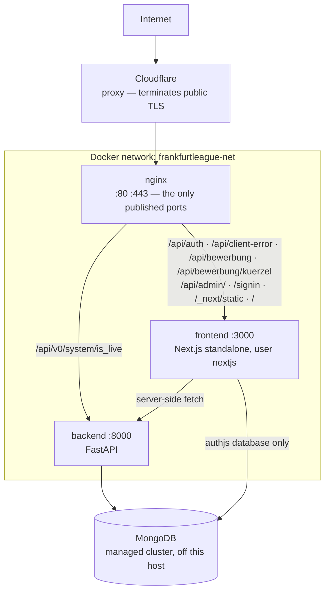

# Ops — overview

**Scope:** `docker-compose*.yml`, `nginx/`, `scripts/`, both Dockerfiles

Three containers behind nginx on one host, deployed by pulling published images. There is no
orchestrator, no CI runner and no build on the server — deliberately, because a server that builds is
a server that can fail a build.

## How it is organised

**The diagram is production's** — the local stack adds its own database service to the same network
and points both application services at it ([`spec.md`](spec.md) §1.5).

**Only nginx publishes a port another host can reach** ([`spec.md`](spec.md) I1), so nginx's routing
table is the whole of what the internet can address on this host.

**The two arrows into the cluster are two different database users**, neither holding a
`*AnyDatabase` role: the backend on the application database alone, Auth.js on `authjs` alone — read
from the cluster's users 2026-08-02, because no file here records either grant. **Never give the two a
shared login** — that makes the boundary a matter of trust rather than of configuration. The backend's
user also needs `collMod` ([`../backend/spec.md`](../backend/spec.md) §4).

## The Cloudflare proxy

Nothing here manages the Cloudflare account, its DNS or its SSL mode, and none of what follows is
visible from a configuration file in this repository.

- **A visitor's TLS session terminates at Cloudflare, not at nginx.** The cipher suites, session
  settings and OCSP stapling in `nginx/prod.conf` govern the Cloudflare-to-origin hop, not what a
  browser negotiates. An origin failure can accordingly surface as a Cloudflare error code
  ([`spec.md`](spec.md) §1.3).
- **The headers a visitor receives are whatever survives the proxy.** They matched `prod.conf` when
  verified 2026-08-01, which makes them a property to re-verify rather than assume.
- **Cloudflare compresses only what arrives uncompressed**, and its own compression measured _worse_
  than the origin's on the same file (2026-08-01), so the origin keeps compressing and brotli is never
  precompressed at build time ([`../../.claude/rules/ops.md`](../../.claude/rules/ops.md)).

**Edge settings deliberately off**, each looking like free performance:

- **Rocket Loader** reorders script execution, which React hydration and Next's streaming depend on.
- **Cloudflare Fonts** removes third-party font requests, and `next/font` self-hosts at build time, so
  there are none.
- **Shared Dictionary Compression** deltas a file against an older version of itself, and every chunk
  here is content-hashed, so a rebuild produces a new filename instead.

**Early Hints** is the one worth turning on — the HTML already emits a `Link: rel=preload` header
Cloudflare can promote to a 103. What is actually set is readable only in the Cloudflare dashboard.

## Routing

A backend route is unreachable from the internet unless an nginx location publishes it
([`spec.md`](spec.md) I13); **a frontend route runs the other way round** — the catch-all carries every
path nginx does not name to Next, so a route handler is reachable the moment it exists, and its own
authorization is all that stands in front of it.

FastAPI's Swagger UI sits at the app root (`/docs`), which the catch-all sends to Next, so the API
documentation is a development and in-network tool.

## Security posture

**The origin is hardened even though a proxy sits above it** — TLS 1.2/1.3 only, the header set at
[`spec.md`](spec.md) §1.4, and I3's `default_server` rejecting an unknown `Host` at TLS time.

**The published unauthenticated writes are rate-limited at the edge**: the sign-in POST, whose action
id ships in a client chunk, the client-error ingest, the public application form's submit, and the
confirmation link's answer, the last two being the ones that write league data. The zones, their
pairing and what carries no zone at all are [`spec.md`](spec.md) §1.3.

## Images and deployment

**The builder stage has no reachable backend and no real environment** ([`spec.md`](spec.md) I5):
anything reaching the API or constructing a URL from `AUTH_URL` at module scope fails the image build
rather than at runtime.

A deploy pulls, recreates the two application containers in place and reloads nginx across the swap
([`spec.md`](spec.md) I6 and I9). What a failed health wait puts back, what it costs, and what to
deploy afterwards are [`runbooks.md`](runbooks.md) §1.

## Read next

- [`spec.md`](spec.md) — the service contracts and the invariants
- [`runbooks.md`](runbooks.md) — the recurring procedures, and what this repository cannot record about the host
- [`../frontend/overview.md`](../frontend/overview.md) — the application server behind nginx
- [`../backend/overview.md`](../backend/overview.md) — the API it fetches from
