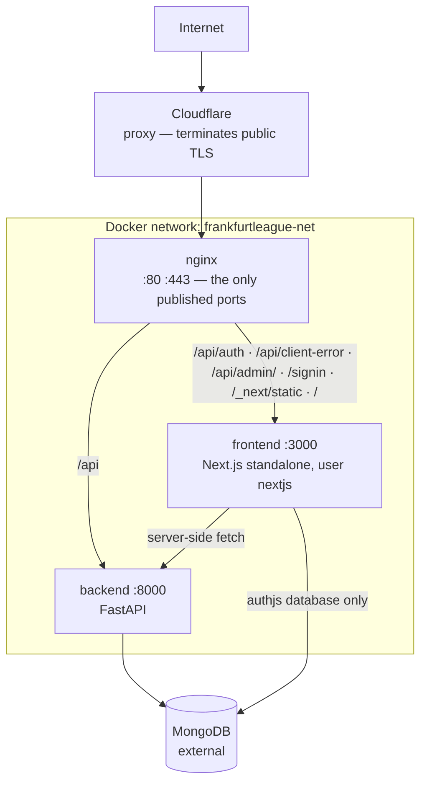

# Ops — overview

**Verified against:** `cda2912d`, 2026-08-19\
**Scope:** `docker-compose*.yml`, `nginx/`, `scripts/`, both Dockerfiles

Three containers behind nginx on one host, deployed by pulling published images. There is no orchestrator,
no CI runner and no build on the server — deliberately, because a server that builds is a server that can
fail a build.

> **[`spec.md`](spec.md) is the operational manual** and [`runbooks.md`](runbooks.md) holds the recurring
> procedures. What follows is the topology and the constraints they assume.

## How it is organised

**Only nginx publishes ports** ([`spec.md`](spec.md) I1), so anything not in nginx's routing table does not
exist for the internet.

**The two arrows into MongoDB are two different database users**, neither holding a `*AnyDatabase` role: the
backend on the application database alone, Auth.js on `authjs` alone, read from the cluster's users 2026-08-02
because no file here records either grant. **Never give the two a shared login** — that makes the boundary a
matter of trust rather than of configuration. Auth.js reaching **its own** database is the one sanctioned
direct reach from the frontend into MongoDB ([`../frontend/overview.md`](../frontend/overview.md)); the
backend's user also needs `collMod` ([`../backend/spec.md`](../backend/spec.md) §4).

## The Cloudflare proxy

Nothing here manages the Cloudflare account, its DNS or its SSL mode, and none of what follows is visible
from a configuration file in this repository.

- **A visitor's TLS session terminates at Cloudflare, not at nginx.** The cipher suites, session settings and
  OCSP stapling in `nginx/prod.conf` govern the Cloudflare-to-origin hop, not what a browser negotiates.
- **An origin failure can surface as a Cloudflare error code**, not as anything nginx logged. A rejected TLS
  handshake at the origin appeared publicly as `525`, naming neither nginx nor the server block behind it.
- **The headers a visitor receives are whatever survives the proxy.** They matched `prod.conf` when verified
  2026-08-01, which makes them a property to re-verify rather than assume.
- **Cloudflare compresses only what arrives uncompressed**, and its own compression measured _worse_ than the
  origin's on the same file — 2026-08-01, 38.7 KB of zstd against 35.9 KB. So the origin keeps compressing,
  and brotli is never precompressed at build time
  ([`../../.claude/CLAUDE.md`](../../.claude/CLAUDE.md) §7).

**Edge settings deliberately off**, each looking like free performance: **Rocket Loader** reorders script
execution, which React hydration and Next's streaming depend on; **Cloudflare Fonts** removes third-party font
requests and `next/font` self-hosts at build time, so there are none; **Shared Dictionary Compression** deltas
a file against an older version of itself, and every chunk here is content-hashed, so a rebuild produces a new
filename instead. **Early Hints** is the one worth turning on — the HTML already emits a `Link: rel=preload`
header Cloudflare can promote to a 103. What is actually set is readable only in the Cloudflare dashboard.

## Routing

nginx matches by longest prefix, and the rule to carry away is that **`/api` goes to the backend while the
more specific `/api` locations do not**: `/api/auth`, `= /api/client-error` and `/api/admin/` each reach the
frontend. The table, with its rate-limit zones and cache headers, is [`spec.md`](spec.md) §1.3.

That is what makes **a frontend route handler unreachable from the internet unless an nginx location
publishes it** — and the reason adding a location for one publishes it. FastAPI's Swagger UI is affected the
same way: it sits at the app root (`/docs`) rather than under `/api`, so the public `/docs` reaches Next
instead, which is why the API documentation is a development and in-network tool.

## Security posture

The values and the arguments behind them are [`spec.md`](spec.md) §1.3–§1.4 and invariants I2–I4. The shape:

- **The origin is hardened even though a proxy sits above it** — TLS 1.2/1.3 only, one enforced CSP, the
  security header set, and a `default_server` rejecting an unknown `Host` at TLS time rather than forwarding
  it verbatim to Next ([`spec.md`](spec.md) I3).
- **The public, unauthenticated entry points are rate-limited at the edge** — the sign-in POST, whose action
  id ships in a client chunk, and the client-error ingest ([`spec.md`](spec.md) §1.3; the sign-in limit
  applies to POST alone, I4).
- **`'unsafe-inline'` on `script-src` is deliberate**, its compensating control being the `react/no-danger`
  lint rule — a nonce cannot cover build-time prerendered HTML.
- **The two application containers drop all capabilities** and set `no-new-privileges`; the nginx container
  does neither ([`spec.md`](spec.md) §4). The frontend runs non-root, and `public/` stays root-owned so the
  app cannot write to it.

## Images and deployment

Both images are multi-stage; the frontend builds to Next's `standalone` output and runs under `tini`. **The
builder stage has no reachable backend and no real environment** ([`spec.md`](spec.md) I5): anything reaching
the API or constructing a URL from `AUTH_URL` at module scope fails the image build rather than at runtime.

Deployment is `pull` plus in-place container recreation, so the interruption is seconds rather than the full
outage a `down`/`up` cycle would cause ([`spec.md`](spec.md) I6 and I9), and nginx waits on **both** services'
health so an unhealthy deploy is never served. Each service's package on GitHub Container Registry is
**public**, which is what lets the server pull anonymously — production holds no registry credentials at all.
Rollback is pulling a pinned `:sha-<commit>` tag; every image carries OCI labels recording the commit it was
built from, which is why `deploy.sh --status` stays truthful even if a tag was moved.

## Environments and secrets

The environments are deliberately separated — dev, local and prod ([`spec.md`](spec.md) §1.5). The one to
know before touching packaging: **local** runs the production image built from the working tree, behind
nginx, which makes it the only place a packaging problem is visible before a deploy.

Both services read a `.env` file supplied by Compose; neither is in the repository. The frontend validates its
environment at startup and **fails with variable names only, never values**. The API keys must match on both
sides, and the length rule is [`spec.md`](spec.md) I11.

## Read next

- [`spec.md`](spec.md) — the service contracts and the invariants
- [`runbooks.md`](runbooks.md) — the recurring procedures, and what this repository cannot record about the host
- [`../frontend/overview.md`](../frontend/overview.md) — the application server behind nginx
- [`../backend/overview.md`](../backend/overview.md) — the API it fetches from
