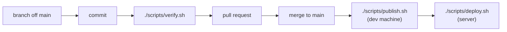

# Workflows

**Verified against:** `52b6ef5`, 2026-08-01
**Scope:** how work gets from an idea to production, and the recurring operational tasks

Cross-cutting, like the glossary — this belongs to no single surface.

Everything below the "Assessment" heading is **observed from git history and the scripts**, not invented.
Where something is a recommendation rather than current practice, it says so.

---

## The shape of the work



Two properties of this pipeline are deliberate and worth stating up front:

- **Images are built on the development machine, never on the server.** A server that builds is a
  server that can fail a build — at the worst moment, with the site down.
- **Merging does not deploy.** Publishing and deploying are separate manual steps. There is no
  automation between `main` and production.

---

## Branching

`main` is the only long-lived branch. There is no `develop`, no release branches, and no long-running
feature branches.

Work happens on **short-lived topic branches cut from `main`**, named in kebab-case for the change
itself:

```
wave-8c-config
prettier-allowlist-scope
publish-prune-local-sha-tags
ledger-fix-part6-section-lists
```

**No prefix taxonomy** — no `feature/`, `fix/`, `chore/`. The name describes what the branch does.

That works because branches are short-lived and there is one maintainer; a prefix scheme earns its keep
when many people scan a long branch list, which is not this repo.

---

## Commits

The convention is consistent across the whole history and is **not** Conventional Commits.

### Subject

```
Scope: what changed
```

Sentence case after the scope. The scope is a real area of the codebase or the programme — `Wave 8c`,
`Backend`, `Brand`, `Ledger`, `Wave 7 review`. Real examples:

```
Wave 8b: named component exports, and one folder rule for all of them
Backend: pick up the resolved dependency upgrades
Brand: the header mark gets the full treatment, not the clean one
Wave 7 review: remove the React Compiler, hand-write the two memos
```

Note the frequent two-clause subject joined by ", and" — one commit, two related changes, both named.

### Body

**This is where the real documentation lives, and it is unusually good.** Bodies are prose, wrapped at
roughly 76 characters, organised into paragraphs each led by the area it concerns:

```
Cache tags (D2). Twenty granular tags were constructed across eight query
modules and not one was ever invalidated -- the code read as though targeted
invalidation worked, and nothing used it. The two that a mutation can actually
reach are kept and now wired up: ...

Client boundaries. Three view components dropped a "use client" that bought
nothing -- none has a hook or a handler, and their interactive children declare
their own boundaries ...
```

What makes them work, and what to keep doing:

- They explain **why**, not what. The diff shows what.
- They record **what was verified and how** — "Verified in the browser: six items with correct hrefs,
  three labelled sections, and ArrowDown moves focus."
- They record **where a prior assumption turned out to be wrong** — "R3a warned this might not work
  because the collection API could need client-rendered descendants. It does work ..."
- They name the rejected alternative when there was one.

No trailers, no issue-closing keywords, no emoji.

> **Since 2026-08-01, one rule constrains commits:** a change that invalidates a documented claim
> updates the doc **in the same commit**. That is the only mechanism preventing documentation drift, and
> it lives in CLAUDE.md §10.

---

## Pull requests

Every change reaches `main` through a PR, merged with a **merge commit** — `Merge pull request #46 from
felzab/wave-8b-naming`. Not squash, not rebase.

That is the right choice here **because the commit bodies are the documentation**. Squashing would
collapse several carefully-written bodies into one and lose the structure; rebasing would discard the
merge point that groups them.

### Titles and bodies

> **Not directly verifiable from the repository.** PR titles and bodies live on GitHub, and `gh` is not
> installed on this machine. What follows is derived from the commit convention, which the PR should
> match — treat it as the standard rather than as an observation.

**Title:** the same shape as a commit subject — `Scope: what changed`. For a single-commit PR, use the
commit subject verbatim.

**Body:** for a single-commit PR, the commit body already says it; a short pointer is enough. For a
multi-commit PR, summarise at the level the commits do not — what the branch achieves as a whole, and
anything a reviewer should check first.

Worth including, because this repo's history shows they matter:

- **What was verified, and how.** Especially for anything the type checker cannot see: RSC boundaries,
  cache invalidation, rendered output.
- **Anything deliberately left undone**, and why.
- **A link to the ADR** if the change touches a ratified decision.

Do not restate the diff.

---

## The verification gate

```bash
./scripts/verify.sh
```

Runs cheapest-to-fail first: script self-checks, then `pnpm verify` (types, lint, formatting,
`next build`, unit tests), then `pnpm audit:prod`, then **ruff and pytest for the backend**, then both
image builds, then a check that `instrumentation.js` survived into the frontend image.

`--quick` skips the image builds and is **not sufficient** before a merge touching
`src/core/config.ts`, `src/core/auth.ts` or `src/instrumentation.ts` — those are where packaging
problems live.

CI runs the same script — `.github/workflows/verify.yml`, `--quick` on pull requests and the full gate
on pushes to `main`.

> **`pnpm format` reaches outside `fl_frontend`, via a hardcoded list of paths.** It currently covers
> `../docs`, `../scripts`, `../.claude`, `../.github`, `../README.md` and both compose files. Moving,
> renaming or adding a root-level file therefore requires editing `fl_frontend/package.json` — and a
> path that no longer exists makes Prettier exit 2, which fails the whole gate. Moving `CLAUDE.md`
> into `.claude/` broke `main` exactly this way.
>
> **Verify with `./scripts/verify.sh --quick`, never with a hand-written `prettier` command.** Running
> Prettier directly on the paths you happen to remember is what let that breakage through.

> **When bumping an action version, verify the tag exists by fetching
> `https://raw.githubusercontent.com/<owner>/<repo>/<tag>/action.yml`.** A 404 means the tag is not
> there. Release _pages_ render dynamically and summarise unreliably; the raw file is unambiguous.
> This is not hypothetical — the first CI run failed instantly on `astral-sh/setup-uv@v9`, a version
> that has never existed, taken from a bad reading of a release page.

Full detail: [`../scripts/README.md`](../scripts/README.md).

---

## Deployment

Three commands, two machines.

| Step                         | Where         | Command                           |
| ---------------------------- | ------------- | --------------------------------- |
| See it as production sees it | dev (Windows) | `./scripts/local.sh`              |
| Build, tag, push both images | dev (Windows) | `./scripts/publish.sh`            |
| Pull and restart             | prod (Linux)  | `git pull && ./scripts/deploy.sh` |

`local.sh` runs the **production image** behind nginx on your machine. It is the only place a packaging
problem — a missing standalone file, a failing startup env gate, a header that nginx does not set — is
visible before a deploy.

`publish.sh` **builds both images before pushing either**, so a failed backend build cannot leave
production able to pull a frontend that expects it. It refuses a dirty working tree by default: a tag
naming a commit must be rebuildable from that commit.

`deploy.sh` never builds. It checks the files nginx mounts, pulls, records the currently-live commit,
recreates the containers **in place** so the interruption is seconds rather than a full outage, waits
for health, and confirms the live security headers. nginx waits on the frontend's health, so an
unhealthy deploy is never served.

### Rolling back

```bash
./scripts/deploy.sh --status        # what is live, and from which commit
./scripts/deploy.sh sha-1a2b3c4     # go back to a published build
```

The `commit` line comes from the image's own OCI label, not the tag name — a tag can be moved, a label
cannot. Rollback works by pulling a pinned `-sha-<commit>` tag, so **the registry is the rollback
mechanism**; keep roughly the last five sha tags per service.

### The server

**The repository does not record which host this is**, and deliberately holds no credentials. What it
does tell you: `deploy.sh` refuses to run anywhere but Linux, runs from a checkout of this repo on the
server, and expects `./certs/` and `./nginx/prod.conf` to exist beside the compose file. Getting onto
the machine is outside the repo.

---

## Operational workflows

### After editing seasons, players or matchdays directly in MongoDB

```bash
./scripts/revalidate_reference_data.sh saisons
```

Those three resources have no write path, are cached for a day, and nothing invalidates them
automatically. Forgetting is not harmful — the cache expires within 24 hours regardless.
See [ADR-0015](_decisions/0015-backend-triggered-revalidation-route.md).

### After changing anything about the brand mark

```bash
cd fl_frontend && pnpm brand
```

Regenerates the favicon, app icons, both manifest sets, the Open Graph card and the `FLLogo` component
from one parameterised source. **Re-run it rather than editing any of its outputs**, or the header mark
and the icons drift apart.

### Granting or revoking admin access

Admin is an **email allowlist**, not a stored role: `ALLOWED_ADMIN_EMAILS` in `fl_frontend/.env`.
Changing it requires a restart, because the environment is validated at boot.

**Revocation is not immediate.** There is no in-app sign-out, so an existing session survives until it
expires — 8 hours. To revoke now, delete the session row from the `authjs` database.

### Season rollover

> **Derived from the data model, not from an observed rollover.** There is no write path for seasons
> (ledger BE-4), so this is done directly in MongoDB and is not covered by any script or validation.

A new season needs, at minimum:

1. A `saisons` document whose `_id` is **exactly four characters** — every `saison_id` referencing it is
   constrained to that length, and a longer id breaks every match and matchday pointing at it.
2. Its `status` set to `active`, and the outgoing season moved off `active`. Exactly one active season
   is assumed; nothing enforces it.
3. A **`saison_teams` junction row per participating team**, carrying `gruppe`, `statistik` and
   `is_disqualified`. A team with no row for the season disappears from that season's results entirely
   — the join is strict.
4. **A junction row for the "TBD" placeholder team**, which is easy to miss and is one of the reasons
   the placeholder is a known modelling flaw (ledger BE-9, Part 5).
5. `spieltage` documents with `order_val` set — the bracket orders by that, not by date.

Then run the revalidation script for `saisons` and `spieltage`.

### Certificate renewal

Certificates are mounted read-only from `./certs` on the server. **Renewal is outside this repo** and is
not scripted here.

---

## Assessment: is this best practice?

The user-facing question is whether these workflows are _right_, not just what they are. Honestly:

### What is genuinely good

**The commit bodies.** They record why, what was verified, and where an earlier assumption was wrong.
That is better than most commercial repositories manage, and it is the single most valuable artifact in
the history.

**Building on dev, never on the server**, and building both images before pushing either. Both remove a
class of failure that hurts most when you can least afford it.

**In-place container recreation** rather than down/up, so a deploy costs seconds of interruption.

**Rollback by pinned tag, verified from the image's own label.** Reading what is live rather than
recalling it is the correct instinct.

### The one real gap: nothing runs the gate

`verify.sh` is thorough and it is **entirely manual**. There is no `.github/workflows/`, no git hook, no
enforcement of any kind. A tired evening merge that skipped it is indistinguishable from one that did
not.

**Recommendation: add a GitHub Actions workflow that runs `verify.sh` on pull requests.** The script
already exists, already exits non-zero correctly, and already orders itself cheapest-to-fail-first. The
work is a workflow file, not a testing strategy. This is the highest-value process change available and
it is small.

Caveats worth knowing before doing it: the image-build steps are slow in CI, so `--quick` on PRs with
the full run on `main` is a reasonable split; and the backend steps need `uv sync --dev`.

### What is fine as-is, and should not be "fixed"

**No Conventional Commits.** `feat:`/`fix:` prefixes buy automated changelogs and semantic versioning.
This is a website with no released artifact and no consumers to notify. The prose bodies here carry far
more than a machine-readable prefix would, and adopting the convention would add ceremony for nothing.

**No branch prefixes.** See Branching — they earn their keep at a scale this repo is not at.

**Merge commits rather than squash.** Squashing would destroy the commit bodies, which are the point.

**No PR template.** With one maintainer and bodies this consistent, a template would be filled in from
habit rather than read.

**Manual deploy rather than continuous deployment.** Deploying on merge would remove the deliberate
gap between "merged" and "live" — and for a site whose owner is also its only operator, that gap is
worth more than the automation.
