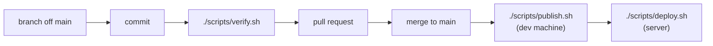

# Workflows

**Verified against:** `3014d32`, 2026-08-08
**Scope:** how work gets from an idea to production, and the recurring operational tasks

Cross-cutting, like the glossary — this belongs to no single surface. Its sibling
[`message-templates.md`](message-templates.md) holds the copy-paste forms for everything this page
argues about; keep the reasoning here and the shapes there.

Everything below the "Assessment" heading is **observed from git history and the scripts**, not invented.
Where something is a recommendation rather than current practice, it says so.

---

## The shape of the work



Two properties of this pipeline are deliberate and worth stating up front:

- **Images are built on the development machine, never on the server.** A server that builds is a
  server that can fail a build — at the worst moment, with the site down.
- **Merging does not deploy.** Publishing and deploying are separate manual steps. There is no
  automation between `main` and production.

---

## The cycle, command by command

The whole loop, in the order you actually type it. Everything below is dev (Windows, Git Bash)
except where marked; the sections after this one explain _why_ each step is shaped as it is.

```bash
# 1 — start from a current main, always
git checkout main
git pull --ff-only origin main
git checkout -b short-kebab-name
```

```bash
# 2 — work, then commit. Small commits, each with a real body (see Commits below)
git add -A
git commit          # opens the editor; a one-line -m loses the part that matters
```

```bash
# 3 — the gate, before pushing: everything, or the scopes covering what you
#     touched. Full form if you touched config, auth, instrumentation or
#     packaging — unless the change is comments only, which is --docs.
#     The gate checks that choice against the diff before it runs anything
./scripts/verify.sh
```

```bash
# 4 — push and open the PR
git push -u origin short-kebab-name
```

```bash
# 4b — open it as a draft, never as ready
gh pr create --draft --title "Scope: what changed" --body-file <path>
```

**Every pull request is opened as a draft, whoever opens it.** A draft runs CI exactly as a ready
one does and **cannot be merged until it is marked ready**, so the window between "here is the
branch" and "I have read it" is a state GitHub enforces rather than one everybody remembers. That
window is where a pull request actually lives: it is handed over before it is reviewed, and marking
it ready is the act of saying it survived review.

Title and body follow [`message-templates.md`](message-templates.md). Marking ready and merging are
**mine, and only mine** — I merge with the **merge commit** button, and delete the remote branch
when GitHub offers.

`gh` is installed and authenticated, and the boundary is worth stating precisely because the tool
no longer draws it by being absent:

| Run                                                            | Never run                          |
| -------------------------------------------------------------- | ---------------------------------- |
| `gh pr create --draft` — opening one, always in this form      | `gh pr create` without `--draft`   |
| `gh pr view`, `gh pr checks`, `gh run view` — reading anything | `gh pr ready` — that is the review |
| `gh pr edit --body-file` — correcting a body after a change    | `gh pr merge`                      |

**Editing beats reopening.** Pushing another commit updates an open pull request in place, and
`gh pr edit` rewrites the title and body without touching anything else; the number and the URL
survive both. The only change that costs something is rewriting the branch's own commits, which
moves every line a review comment is anchored to.

```bash
# 5 — bring the merge back down and clean up
git checkout main
git pull --ff-only origin main
git branch -d short-kebab-name
```

**`--ff-only` is the point of step 5.** Because every change reaches `main` through GitHub, your
local `main` is only ever strictly behind — a fast-forward is always possible. If it somehow is not,
`--ff-only` refuses instead of silently inventing a merge commit, which is exactly the moment you
want to stop and look. `git pull` without it would paper over the surprise.

`git fetch` followed by `git reset --hard origin/main` reaches the same place and is what you want
only when local `main` has drifted and you are certain it holds nothing of value. It discards
without asking; prefer `--ff-only` and let it fail.

### When a push to `main` is rejected

```
! [remote rejected] main -> main (push declined due to repository rule violations)
```

That is the ruleset working, not a problem: `main` takes changes only through a pull request with a
passing `verify`. If you have already committed to local `main`, nothing is lost — move the commits
onto a branch and rewind:

```bash
git branch short-kebab-name        # mark the commits
git reset --hard origin/main       # rewind main to the remote
git push -u origin short-kebab-name
```

Then open the PR as usual. The commits are intact on the branch; only the branch pointer moved.

---

## Branching

`main` is the only long-lived branch. There is no `develop`, no release branches, and no long-running
feature branches.

Work happens on **short-lived topic branches cut from `main`**, named in kebab-case for the change
itself:

```
wave-8c-config
prettier-allowlist-scope
publish-prune-local-sha-tags
ledger-fix-part6-section-lists
```

**No prefix taxonomy** — no `feature/`, `fix/`, `chore/`. The name describes what the branch does.

That works because branches are short-lived and there is one maintainer; a prefix scheme earns its keep
when many people scan a long branch list, which is not this repo.

---

## Commits

The convention is consistent across the whole history and is **not** Conventional Commits.

### Subject

```
Scope: what changed
```

Sentence case after the scope, no trailing period, and the scope comes from the closed-ish table in
[`message-templates.md`](message-templates.md) — twelve real areas, and a new one is reported rather
than refused. Subjects here are **declarative rather than imperative**, which departs from the
convention most projects follow and is deliberate: the whole convention-era history reads that way,
and a log that is consistent with itself beats one that matches a rule it never followed. Real
examples:

```
Frontend: named component exports, and one folder rule for all of them
Backend: pick up the resolved dependency upgrades
Brand: the header mark gets the full treatment, not the clean one
Ops: ghcr publishing needs a classic token, and the failure is misleading
```

Note the frequent two-clause subject joined by ", and" — one commit, two related changes, both named.

### Body

**This is where the real documentation lives, and it is unusually good.** Bodies are prose, wrapped at
roughly 76 characters, organised into paragraphs each led by the area it concerns:

```
Cache tags (D2). Twenty granular tags were constructed across eight query
modules and not one was ever invalidated -- the code read as though targeted
invalidation worked, and nothing used it. The two that a mutation can actually
reach are kept and now wired up: ...

Client boundaries. Three view components dropped a "use client" that bought
nothing -- none has a hook or a handler, and their interactive children declare
their own boundaries ...
```

What makes them work, and what to keep doing:

- They explain **why**, not what. The diff shows what.
- They record **what was verified and how** — "Verified in the browser: six items with correct hrefs,
  three labelled sections, and ArrowDown moves focus."
- They record **where a prior assumption turned out to be wrong** — "R3a warned this might not work
  because the collection API could need client-rendered descendants. It does work ..."
- They name the rejected alternative when there was one.

No issue-closing keywords, no emoji, and no trailers. There is no exception for assistant-authored
commits: work is never signed as AI-generated (CLAUDE.md, §2), which overrides any tool default
that would append a `Co-Authored-By` line.

**None of that rests on memory any more.** `scripts/check_commits.py` refuses a message with no
body, an unwrapped line, a malformed subject, a trailer, an emoji or an issue-closing keyword — as a
`commit-msg` hook when you write it, in the `--docs` gate scope before you push, and in CI on every
pull request. It reads the branch's commits only, never history, which predates the convention.
What it refuses and what it merely reports, and why the two lists are different lists, is in
[`message-templates.md`](message-templates.md).

**Copy-paste form: [`message-templates.md`](message-templates.md).** That page holds the shape; this
one holds the reasoning.

> **Since 2026-08-01, one rule constrains commits:** a change that invalidates a documented claim
> updates the doc **in the same commit**. That is the only mechanism preventing documentation drift, and
> it lives in CLAUDE.md's documentation section.

---

## Pull requests

Every change reaches `main` through a PR, merged with a **merge commit** — `Merge pull request #46 from
felzab/wave-8b-naming`. Not squash, not rebase.

That is the right choice here **because the commit bodies are the documentation**. Squashing would
collapse several carefully-written bodies into one and lose the structure; rebasing would discard the
merge point that groups them.

### Titles and bodies

> **Confirmed by reading, not by the gate.** Bodies live on GitHub, so this section was checked
> against the forty-five merged pull requests on 2026-08-05. Every human-authored body follows the
> template. Dependabot's do not, and are outside it — the bot writes its own. Re-check with
> `gh pr list --state merged --json number,title` and `gh pr view <n> --json body` rather than
> reasoning from the commit convention.

**Title:** the same shape as a commit subject — `Scope: what changed`. For a single-commit PR, use the
commit subject verbatim.

**Body: a summary of the branch, never an index of its commits**
([ADR-0036](../_decisions/0036-a-pull-request-body-summarises-the-branch.md)). GitHub renders every
commit of a pull request in its own tab, each with its full body one click away, so a body listing
one line per commit reproduces a view the reviewer already has — fifteen times over, on a branch the
size of the one merged as `738c2b3`.

- **A single-commit PR** gets a pointer, because the commit body already says it.
- **A multi-commit PR opens with one orientation sentence** — how many commits there are and what
  they do, grouped by theme — and then summarises at the level no commit reaches: what the branch
  achieves as a whole, and anything a reviewer should look at first.

Three things only the body can carry, which is why the template's headings are what they are:

- **What was verified, and how.** A gate invocation covers the branch; no single commit's body can
  claim it. Especially for anything the type checker cannot see: RSC boundaries, cache invalidation,
  rendered output.
- **Anything deliberately left undone**, and why — including work proposed to me and awaiting
  my decision, which is not a change any commit made.
- **A link to the ADR** if the change touches a ratified decision.

Do not restate the diff, and do not restate the Commits tab.

**A PR body must stand alone.** `docs/audit/` is gitignored, so a reviewer sees none of it — never
point at anything under it from a body. Open items live in [`docs/roadmap/open-items.md`](../roadmap/open-items.md).

**Copy-paste form: [`message-templates.md`](message-templates.md)**, which also covers issues.

---

## The verification gate

```bash
./scripts/verify.sh
```

Seven scopes in cheapest-to-fail order — script self-checks, the documentation gate, **ruff,
pyright and pytest for the backend**, the frontend toolchain (prettier, tsc, eslint, `next build`,
unit tests) with the advisory dependency audit, the ops checks (compose files and nginx config),
the database test tier, and both image builds with a check that `instrumentation.js` survived into
the frontend image. A bare invocation runs everything; scope flags name surfaces and combine — the
table is in [`scripts/README.md`](../../scripts/README.md).

The **documentation gate** fails on any citation that resolves to nothing — a dangling ADR number, a
dead link, a broken anchor, a named path that is not there — in `/docs` and inside source comments
alike. Rules: [`docs/_standard/chapters/5-currency.md`](../_standard/chapters/5-currency.md).

`--quick` skips everything that needs Docker: the database test tier and both image builds. A run
without the images scope is **not sufficient** before a merge touching `src/core/config.ts`,
`src/core/auth.ts`, `src/instrumentation.ts`, `next.config.ts`, a lockfile or a Dockerfile — those
are where packaging problems live, and CI builds both images on any pull request touching them.

**The scope you type is checked against the diff before any of it runs**
([ADR-0037](../_decisions/0037-the-gate-refuses-an-undersized-scope.md)). `scripts/check_scope.py`
refuses a run that skips the image build while the branch changes a file asking for it by more than
comments, and reports every other surface the run leaves unproven. Whether a change is comments only
is decided by a parser — TypeScript's own for `.ts`, `ast` for Python, `tomllib` for TOML — and
anything it cannot prove counts as code, so a Dockerfile whose only change is a comment still asks
for the full form. CI skips the check: there the scopes come from the paths, not from a flag.

CI — `.github/workflows/verify.yml` — runs the same scopes as **parallel jobs, mapped from the paths
a pull request touches**: a docs-only PR runs the documentation gate and a formatting check, a
backend PR runs the backend tier with its `backend-db` database job
([ADR-0030](../_decisions/0030-a-real-mongod-behind-a-deselected-marker.md)) and nothing frontend,
and a packaging change builds both images before it can merge. A push to `main` runs every scope.
The required status check is the workflow's aggregate `verify` job, which fails if any scope job
failed and passes over the ones path filtering skipped.

**The images job caches its layers in the Actions cache service**, which buildx reaches directly
([ADR-0038](../_decisions/0038-the-image-cache-is-the-actions-cache-service.md)) — there is no cache
archive to download and no cache key to describe the contents wrongly. It is the one job needing a
credential the runner withholds from `run:` steps, so a local action exposes it first, and the scope
checks for it before building rather than discovering it at the export, after every layer is
already built.

> **`pnpm format` covers the whole repository**: it runs prettier over the repo root, and what stays
> out is decided by exactly two ignore files — `.prettierignore` at the root (trees prettier must
> never enter, and local machine files) and `fl_frontend/.prettierignore` (the frontend's own
> artifacts). There is no path list to keep in step, so moving, renaming or adding a file cannot
> make the formatter fail on a path that no longer exists — the failure mode that once broke `main`
> when `CLAUDE.md` moved. The ignore files are the only thing to maintain: a new generated tree
> that prettier should not touch gets a line in the root ignore file.
>
> **Verify with a gate run whose scope includes the formatter — `./scripts/verify.sh --quick` or
> `--frontend` — never with a hand-written `prettier` command.** Running Prettier directly on the
> paths you happen to remember is what let that breakage through. In CI, the `format` job runs the
> check for changes outside `fl_frontend`.

> **When bumping an action version, verify the tag exists by fetching
> `https://raw.githubusercontent.com/<owner>/<repo>/<tag>/action.yml`.** A 404 means the tag is not
> there. Release _pages_ render dynamically and summarise unreliably; the raw file is unambiguous.
> This is not hypothetical — the first CI run failed instantly on `astral-sh/setup-uv@v9`, a version
> that has never existed, taken from a bad reading of a release page.

Full detail: [`../scripts/README.md`](../../scripts/README.md).

---

## Repository settings

**Configured 2026-08-01, and written down because nothing else records them.** Repository settings
live only in GitHub's UI: they are unversioned, invisible in a checkout, and **deleting a repository
destroys them** — which is not hypothetical here, since recreating the repo during the history
rewrite reset every one of them to its default. This section is the checklist that restores them.

### Merging

Only **merge commits** are enabled; squash and rebase merging are switched off in
Settings → General → Pull Requests. That is not a preference — squashing collapses the carefully
written commit bodies that are this repository's most valuable artifact, and a single accidental
squash-merge destroys them irreversibly. Disabling the option is what makes the convention
enforceable rather than merely documented.

### Ruleset on `main`

Settings → Rules → Rulesets, one branch ruleset targeting the default branch, enforcement **Active**.

| Rule                                  | Setting                                 |
| ------------------------------------- | --------------------------------------- |
| Restrict deletions                    | on                                      |
| Block force pushes                    | on                                      |
| Require a pull request before merging | on, **required approvals `0`**          |
| Require status checks to pass         | on, checks: **`verify`**, **`pr-body`** |
| Require linear history                | **off**                                 |
| Bypass list                           | **empty**                               |

Three of those are counter-intuitive and must not be "corrected":

- **Required approvals stays at `0`.** A single maintainer cannot approve their own pull request, so
  any value above zero blocks every merge permanently.
- **Linear history stays off.** It forbids merge commits, and with squash and rebase already
  disabled, enabling it would leave no permitted merge method at all.
- **The bypass list stays empty.** The accident this guards against — a force-push to `main` — is
  the maintainer's own. To perform a deliberate history rewrite, set the ruleset to **Disabled**, do
  it, and re-enable; that two-step is the intended escape hatch.

**Two required checks.** `verify` is `.github/workflows/verify.yml`'s aggregate job. `pr-body` is
`.github/workflows/pr-body.yml`, which holds the body to
[ADR-0036](../_decisions/0036-a-pull-request-body-summarises-the-branch.md) and is a separate
workflow because it listens for `edited` — subscribing `verify.yml` to that event would rebuild both
images every time a description gained a comma. **Each required check is added by hand in this
panel; a workflow existing does not make it required**, so a new one reports until someone adds it
here.

CodeQL deliberately is **not** required: it reports two checks and an upstream query-pack problem
would block merges for a reason unrelated to the change.

### Actions

Settings → Actions → General:

- **Actions permissions** — GitHub-authored actions allowed, plus an allowlist for the two
  third-party ones in use: `pnpm/action-setup@*` and `astral-sh/setup-uv@*`. **An action living in
  this repository needs no entry** — `./.github/actions/actions-runtime-env` is read from the
  checkout, which is why owning thirty-two lines beat allowlisting a fourth third-party action
  ([ADR-0038](../_decisions/0038-the-image-cache-is-the-actions-cache-service.md)).
- **Every action is pinned to an exact version**, never a floating major tag. A `@v7` tag moves
  under you: what CI executed last week is not necessarily what it executes today, and the window
  where a repointed tag changes your build is exactly the supply-chain risk pinning closes. The
  trade accepted in return is that upstream patches no longer arrive on their own — they arrive as
  a Dependabot pull request, which is what makes the pins sustainable rather than a thing that
  rots. **When adding an action, pin it and verify the tag exists** by fetching its raw
  `action.yml` (see the note under the verification gate). A local `./` action needs no pin: it
  moves only when a commit moves it, which is the property a pin buys for the others.
- **Fork pull request workflows** — _require approval for all outside collaborators_. On a public
  repository anyone can fork and open a pull request; without this, a stranger's first PR runs
  workflows unreviewed. Both workflows trigger on `pull_request` rather than `pull_request_target`,
  so a fork's run receives no secrets and no write token — keep it that way.
- **Default workflow permissions** — read-only, and Actions may not create or approve pull requests.
  Both workflows declare their own `permissions:` block, but a future one that forgets inherits this.

### Security

Settings → Security → Advanced Security:

- **Secret scanning** and **push protection** — on. Note the limit: these match known provider token
  formats, so they will not catch `INTERNAL_API_KEY_*` or `AUTH_SECRET`, which are arbitrary
  strings. What protects those is `.env*` being gitignored and excluded from both Docker build
  contexts.
- **Dependabot alerts** and **Dependabot security updates** — on. These are separate from
  `.github/dependabot.yml`, which governs only routine monthly version updates; without these
  toggles a published advisory produces no notification at all.
- **Code scanning** — configured entirely by `.github/workflows/codeql.yml` (advanced setup). **Do
  not use the "Set up" button**: it writes a second, competing default configuration through the web
  editor. The workflow file is the enablement.

**Dependabot version updates need no toggle** — the presence of `.github/dependabot.yml` on the
default branch is what enables them, which is why that settings entry links to the file instead of
offering a switch.

---

## Deployment

Three commands, two machines.

| Step                         | Where         | Command                           |
| ---------------------------- | ------------- | --------------------------------- |
| See it as production sees it | dev (Windows) | `./scripts/local.sh`              |
| Build, tag, push both images | dev (Windows) | `./scripts/publish.sh`            |
| Pull and restart             | prod (Linux)  | `git pull && ./scripts/deploy.sh` |

`local.sh` runs the **production image** behind nginx on your machine. It is the only place a packaging
problem — a missing standalone file, a failing startup env gate, a header that nginx does not set — is
visible before a deploy.

`publish.sh` **builds both images before pushing either**, so a failed backend build cannot leave
production able to pull a frontend that expects it. It refuses a dirty working tree by default: a tag
naming a commit must be rebuildable from that commit.

`deploy.sh` never builds. It checks the files nginx mounts, pulls, records the currently-live commit,
recreates the containers **in place** so the interruption is seconds rather than a full outage, waits
for health, and confirms the live security headers. nginx waits on the frontend's health, so an
unhealthy deploy is never served.

### Rolling back

```bash
./scripts/deploy.sh --status        # what is live, and from which commit
./scripts/deploy.sh sha-1a2b3c4     # go back to a published build
```

The `commit` line comes from the image's own OCI label, not the tag name — a tag can be moved, a label
cannot. Rollback works by pulling a pinned `:sha-<commit>` tag, so **the registry is the rollback
mechanism**; keep roughly the last five `sha-` tags in each package (ADR-0017).

### The server

**The repository does not record which host this is**, and deliberately holds no credentials. What it
does tell you: `deploy.sh` refuses to run anywhere but Linux, runs from a checkout of this repo on the
server, and expects `./certs/` and `./nginx/prod.conf` to exist beside the compose file. Getting onto
the machine is outside the repo.

---

## Operational workflows

### After editing seasons, players or matchdays directly in MongoDB

`saisons`, `spieler` and `spieltage` are cached for a day, and **no code path observes a HAND edit to
them** — a change made directly in MongoDB invalidates nothing, so it is invisible until the cache
expires. All three now have admin pages that clear their own tags as they save
([ADR-0063](../_decisions/0063-a-matchday-list-is-the-seasons-skeleton.md) built the last two), so a hand
edit is the exception rather than the rule: an edit made through `/admin` is visible at once, and only one
that goes around the pages is stale. That staleness is bounded by design
([ADR-0035](../_decisions/0035-reference-data-staleness-is-bounded-by-cache-lifetime.md)): 24 hours at
worst, and there is no invalidation endpoint. To make the edit visible sooner, recreate the frontend
container — its cache lives in the container filesystem, so recreation starts empty at the cost of
every cached page:

```bash
# prod (Linux)
docker compose up -d --force-recreate frontend
```

**A hand edit to a season is the one that leaves the most stale**, because a season decides what an omitted
`saison_id` means: the season's own reads, plus `spiele`, `spieltage` and `teams`. Making it through
`/admin/saisons/[saison_id]` clears all four; making it in Compass clears none.

**The backend holds its own season cache on top of that**
([ADR-0070](../_decisions/0070-the-season-document-is-cached-in-process.md)): season documents are
cached in-process for up to ten minutes, dropped by the season write endpoints as they save. An edit
through `/admin` is still visible at once — the write path drops the cache before it answers. A
Compass edit to a season adds up to ten minutes of backend staleness on top of the frontend's day,
and recreating the frontend container alone can therefore still serve the pre-edit season for those
minutes; recreate the backend container too if that matters.

### Before any hand edit that a code change depends on

```bash
./scripts/deploy.sh --status        # what is LIVE, and from which commit
```

**Order a data change against the deployed image, never against `main`.** Merging is not deploying
here — the two are separated on purpose — so `main` routinely describes a service that is not running,
and a migration reasoned about from the checkout can be correct in the repository and destructive in
production.

That is not hypothetical. On 2026-08-02 the `statistik` field was `$unset` from all 17 `saison_teams`
rows, which was safe because the league table had become a derivation
([ADR-0026](../_decisions/0026-team-statistics-are-derived-from-spiele.md)) — safe in `main`. The live
image was a day older and still projected `$saison_data.statistik`, so every team document lost a
required field and `GET /teams` returned 422 until the pending deploy was made.

The direction differs per change, which is why the status command matters more than a rule of thumb:

| The edit                                | Order                                                                                                                  |
| --------------------------------------- | ---------------------------------------------------------------------------------------------------------------------- |
| Removes something the old code reads    | **Deploy first**, then edit — as `statistik` should have been                                                          |
| Must be true before the new code starts | **Edit first**, then deploy — as DB-2's constraints were, since a unique index cannot build over data that violates it |

### Before deploying a change to the database's constraints

```bash
cd fl_backend && .venv/Scripts/python -m app.core.constraints --check
```

Dev (Windows; on the server it is `python -m app.core.constraints --check` inside the backend
container). Writes nothing. It reports every document the validators would reject, every key group that
would stop a unique index building, and whether the database user may run `collMod` at all — which
`readWrite` and `readWriteAnyDatabase` do not grant, though both grant `createIndex`.

Run it whenever `fl_backend/app/core/constraints.py` changes, because the constraints are reapplied on
**every boot** and **a failure is fatal**
([ADR-0027](../_decisions/0027-the-database-enforces-its-own-invariants.md)). A validator that no longer
matches the data does not degrade the service; it stops the container coming up, and nginx then waits
on a health check that never passes. Exit 0 means clean.

`--apply` does the same work startup does, which is how to put a corrected constraint in place without
waiting for a deploy.

### After changing anything about the brand mark

```bash
cd fl_frontend && pnpm brand
```

Regenerates the favicon, app icons, both manifest sets, the Open Graph card and the `FLLogo` component
from one parameterised source. **Re-run it rather than editing any of its outputs**, or the header mark
and the icons drift apart.

### Granting or revoking admin access

Admin is an **email allowlist**, not a stored role: `ALLOWED_ADMIN_EMAILS` in `fl_frontend/.env`.
Changing it requires a restart, because the environment is validated at boot.

**Revocation takes one restart, not eight hours.** `getAdminSession()` demands `role === "admin"`, and
the `session` callback derives that from the allowlist on **every** session read — so once the
container comes back up with the address removed, the next request from that session is refused. The
row stays in the `authjs` database and authorizes nothing; deleting it by hand is tidying, not
revocation.

**An admin ending their own session needs none of that**: the sidemenu's options menu carries a
sign-out, which arms on the first press and ends the session on the second.

### Season rollover

> **Derived from the data model, not from an observed rollover.** Every step below now has both an
> endpoint ([ADR-0034](../_decisions/0034-the-write-path-is-resource-first-in-a-second-router.md)) and an
> admin page, so the whole sequence can be done through `/admin` and each step invalidates its own caches
> as it saves. What still has no prompt is the sequence itself: nothing notices a step that is skipped, and
> nothing announces that the rollover is due. An email reminder is an open roadmap item.

A new season needs, at minimum:

1. A `saisons` document whose `_id` is **exactly four characters** — every `saison_id` referencing it is
   constrained to that length, and a longer id breaks every match and matchday pointing at it. The
   Neue-Saison dialog on `/admin/saisons` creates one over `POST /api/v0/saisons`, always as `future`, and
   the id cannot be changed afterwards.
2. **`POST /api/v0/saisons/{saison_id}/activate`** when the season starts, from the Umstellung panel on
   `/admin/saisons/[saison_id]`. It demotes the outgoing season and promotes this one in one transaction,
   and it is the **only** code path that writes `status`
   ([ADR-0033](../_decisions/0033-one-active-season-and-one-path-to-it.md)). Do not set `status` in
   Compass: two active seasons is a state nothing detects, and `pull_current_saison` then returns
   whichever Mongo hands back first.

   **It carries no "have all the games finished" guard, on purpose.** The panel lists the outgoing
   season's matches that have no result, each linking into its fixture, and activates anyway if you press
   through — an early rollover is a legitimate decision (ADR-0033,
   [ADR-0063](../_decisions/0063-a-matchday-list-is-the-seasons-skeleton.md)).

3. A **`saison_teams` junction row per participating team**, carrying `gruppe` and `disqualifikation` —
   `POST /api/v0/teams/{team_id}/saisons`, which seeds the record as `null`; the Saison-Zugehörigkeit
   panel on `/admin/teams/[team_id]` calls it and invalidates the caches as it saves. A team with no row for the
   season disappears from that
   season's results entirely: the join is strict. No `statistik`, because the league table is derived
   from the season's matches ([ADR-0026](../_decisions/0026-team-statistics-are-derived-from-spiele.md)),
   so a new season starts at zero without anything being written.
4. A **`saison_spieler` row per player** — `POST /api/v0/spieler/{spieler_id}/saisons`, from the Kader
   panel on `/admin/spieler/[spieler_id]`. A player who already has a row for that season comes back
   **409**: creating never revives a retired row, and `POST .../saisons/{saison_id}/reactivate` is what
   brings them back ([ADR-0032](../_decisions/0032-soft-deletion-is-a-date-not-a-flag.md)).
5. `spieltage` documents, one per matchday. `/admin/spieltage` creates them into the season the sidemenu
   selector holds. **There is no position to set**: a matchday's place in the season is derived from its
   phase and its `beginn` ([ADR-0064](../_decisions/0064-a-matchdays-position-is-derived-not-stored.md)), so
   entering the phase and the dates correctly is the whole of it, and a matchday in the wrong place is one
   whose phase or date is wrong.

A playoff fixture whose participants the group phase has not produced yet needs **no team row at all**:
both sides are null, and the card derives what the bracket shows from `team1_quelle` / `team2_quelle`
([ADR-0042](../_decisions/0042-a-result-entry-resolves-the-whole-bracket.md)).

**A rollover done through `/admin` needs nothing afterwards**: the action clears `saisons`, `spiele`,
`spieltage` and `teams`, which is every read an omitted `saison_id` reaches. One done in Compass clears
none of them and stays invisible until the daily cache expiry or a container recreation — the command and
the reasoning are under "After editing seasons, players or matchdays directly in MongoDB" above
([ADR-0035](../_decisions/0035-reference-data-staleness-is-bounded-by-cache-lifetime.md)).

### Certificate renewal

Certificates are mounted read-only from `./certs` on the server. **Renewal is outside this repo** and is
not scripted here.

---

## Assessment: is this best practice?

The user-facing question is whether these workflows are _right_, not just what they are. Honestly:

### What is genuinely good

**The commit bodies.** They record why, what was verified, and where an earlier assumption was wrong.
That is better than most commercial repositories manage, and it is the single most valuable artifact in
the history.

**Building on dev, never on the server**, and building both images before pushing either. Both remove a
class of failure that hurts most when you can least afford it.

**In-place container recreation** rather than down/up, so a deploy costs seconds of interruption.

**Rollback by pinned tag, verified from the image's own label.** Reading what is live rather than
recalling it is the correct instinct.

### Execution and enforcement, both in place

**The gate executes on every change**: `.github/workflows/verify.yml` runs `verify.sh`'s scopes as
parallel jobs mapped to the paths a pull request touches, and every scope on a push to `main` — so
a merge whose author skipped the local gate is checked exactly as one whose author ran it.

**And passing it is required**: the ruleset on `main` (see Repository settings) demands the
aggregate `verify` check before the merge button works. Skipping the gate therefore takes a
deliberate act — disabling the ruleset, which is its documented escape hatch — never an oversight.

### What is fine as-is, and should not be "fixed"

**No Conventional Commits.** `feat:`/`fix:` prefixes buy automated changelogs and semantic versioning.
This is a website with no released artifact and no consumers to notify. The prose bodies here carry far
more than a machine-readable prefix would, and adopting the convention would add ceremony for nothing.

**No branch prefixes.** See Branching — they earn their keep at a scale this repo is not at.

**Merge commits rather than squash** — and the reason is worth restating whenever it is questioned:
squashing would collapse several carefully written bodies into one.

**Manual deploy rather than continuous deployment.** Deploying on merge would remove the deliberate
gap between "merged" and "live" — and for a site I both own and operate alone, that gap is
worth more than the automation.

### Templates, served and binding

[`message-templates.md`](message-templates.md) is the source of every message form, and GitHub
serves its copies — `.github/PULL_REQUEST_TEMPLATE.md` pre-fills each PR body, and
`.github/ISSUE_TEMPLATE/` carries the issue forms for the audience that has never read this page.
The forms bind the maintainer exactly as they bind an outside contributor: a PR body follows the
template rather than habit, and a change to the source page updates the served copies in the same
commit.
